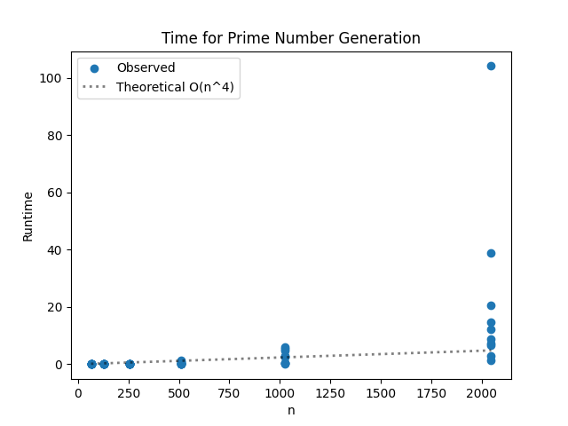
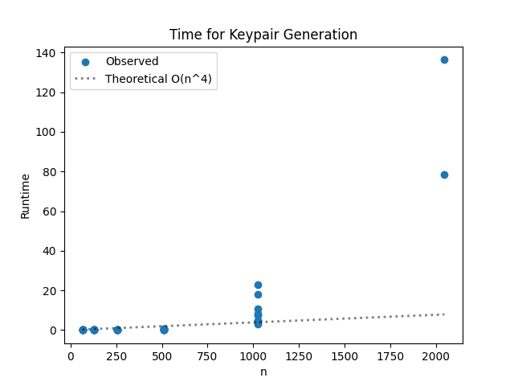

# Project Report - RSA and Primality Tests

## Baseline

### Design Experience

I spoke to my brother Santiago about the design and what an RSA is. I explained how I would start
by creating the algorythm to generate prime numbers and analyze its time and space complexity.

### Theoretical Analysis - Prime Number Generation

#### Time 

Prime number generation makes use of several functions: the generator function,
the fermat test function, and the modular exponentiation function. To analyze the time complexity
of the whole thing we must start at our mod_exp function.

    def mod_exp(x: int, y: int, N: int) -> int:
        if y == 0:                        #O(1) constant time
            return 1                      #O(1) 
    
        z = mod_exp(x, y//2, N)           #Recursion that halves every y: O(logy)

    
        if y % 2 == 0:            #O(1)       
            return (z*z) % N        #O(n^2) for n bit multiplication
        else:
            return (x*z*z) % N  #O(n^2)

The total time complexity for mod_exp is O(n^2logy). 

Next up we have the fermat test:

    def fermat(N: int, k: int) -> bool:
        if N <= 1:         #O(1)
            return False    #O(1)
        if N <= 3:          #O(1)
            return False    #O(1)
    
        for _ in range(k): #O(k)
            a = random.randrange(2, N) #O(1)
    
            if mod_exp(a, N-1, N) != 1: #O(n^2 logN)
                return False         #O(1)
        return True                #O(1)
Thus the total time complexity for fermat(...) is O(k*n^2*logN)
We borrowed the mod_exp time complexity and swapped logy with logN because N-1 corresponds to y in the
mod_exp call. 

Onto the third function:
    
    def generate_large_prime(n_bits: int) -> int:
        while True: # Probablity of a prime number being generated:
                    # 1/(ln(2^n-bits), taken from the text book. 
                    #This means our function runs on average O(n) times. 
            a = random.getrandbits(n_bits)   #O(1)
            a |= (1 << (n_bits - 1))         #O(1)
            a |= 1                           #O(1)
    
            if fermat(a, 20):    #O(20*n^2*log(n-bits))
                return a         #O(1)
The "if fermat" line's complexity becomes O(n^2log(n)) because k = 20, a constant.
This complexity is run O(n) times, so complexity becomes O(n^3log(n)). 
Could also be O(n^4) if you wanna view it that way. 

#### Space

Space complexity for mod_exp:

    def mod_exp(x: int, y: int, N: int) -> int:
        if y == 0:                        
            return 1                     
    
        z = mod_exp(x, y//2, N)          
    
        if y % 2 == 0:            
            return (z*z) % N        
        else:
            return (x*z*z) % N 

z is stored every call, and every call halves y. So the complexity for mod_exp could be O(logy)

For fermat:

    def fermat(N: int, k: int) -> bool:
        if N <= 1:        
            return False    
        if N <= 3:         
            return False   
    
        for _ in range(k): #O(k)
            a = random.randrange(2, N) 
    
            if mod_exp(a, N-1, N) != 1:
                return False        
        return True               

Fermat runs k times, but there's no recursion. Recursion is only found in mod_exp, so we can assume the same space complexity
of O(logN). We use N because N - 1 is what's passed to the y value of mod_exp.

Lastly for the prime number generator:

    def generate_large_prime(n_bits: int) -> int:
        while True:
            a = random.getrandbits(n_bits)
            a |= (1 << (n_bits - 1))
            a |= 1
            if fermat(a, 20):
                return a

This one gets run until a prime number is found. The space complexity could be O(n_bits)

### Empirical Data

| N    | time (sec) |
|------|------------|
| 64   | 0.001      |
| 128  | 0.007      |
| 256  | 0.023      |
| 512  | 0.435      |
| 1024 | 2.58       |
| 2048 | 21.76      |

### Comparison of Theoretical and Empirical Results

- Theoretical order of growth: .001, .007, .023, .435, 2.58, 21.76

The order of growth was the same as the theoretical. The increase in time as the bits increase can be attributed to my 
computer struggling more and more as it has to work with more information. 

## Core

### Design Experience

I didn't really understand how to use euclid's algorythm and the extended version of it, so I spoke to the TA's. Specifically
with Spencer I believe. Anyways, we talked about how I could use the list of prime numbers given to us in the starter code. I told the TA I would first generate the two
random numbers, then I would iterate through the list of primes to find e, and once I found e I would use euclid's extended 
algorythm to get d and then I would just return the e, d and N's I had found. 
### Theoretical Analysis - Key Pair Generation

#### Time 

The time complexity here consists of my function ext_euclid, and the main function generate_keypair
We will look at ext_euclid first:

    def ext_euclid(a: int, b: int) -> tuple[int, int, int]:
        if b == 0:                        #O(n) for large numbers
            return 1, 0, a
        x, y, z = ext_euclid(b, a % b)    #O(n^2)
        return y, x - (a // b) * y,z

Because of the complexity of operations here and recursive calls, the complexity is O(n^3)

Next the main code:

    def generate_key_pairs(n_bits) -> tuple[int, int, int]:
        p = generate_large_prime(n_bits)            #O(n^4)
        q = generate_large_prime(n_bits)            #O(n^4)
    
        N = p*q
        e = None
        prod = (p-1)*(q-1)                          #O(n^2)
    
        for i in primes:
            if gcd(i, prod) == 1:                   #O(n)
                e = i
                break
    
        if e is None:
            raise Exception('No primes found')
    
        #Euclids algorythm
        _, d, g = ext_euclid(prod, e)               #O(n^3)
    
        d = d % prod                                #O(n^2)
    
        return N, e, d

The total time complexity is O(n^4) since the prime number generation dominates everything. 

#### Space
For space complexity we can look at the main code in bulk

    def generate_key_pairs(n_bits) -> tuple[int, int, int]:
        p = generate_large_prime(n_bits)            #O(n)
        q = generate_large_prime(n_bits)            #O(n)
    
        N = p*q                                     #O(n)
        e = None
        prod = (p-1)*(q-1)                          #O(n)
    
        for i in primes:
            if gcd(i, prod) == 1:                   #O(n)
                e = i
                break
    
        if e is None:
            raise Exception('No primes found')
    
        #Euclids algorythm
        _, d, g = ext_euclid(prod, e)               #O(n^2) because of recursion
    
        d = d % prod                                #O(n)
    
        return N, e, d

At the end of the day the space complexity for this portion of the code is O(n^2). This is because euclid's algorythm
dominates the use of space. 

### Empirical Data

| N    | time (sec) |
|------|------------|
| 64   | 0.003      |
| 128  | 0.01       |
| 256  | 0.044      |
| 512  | 0.335      |
| 1024 | 8.793      |
| 2048 | (Too long) |

### Comparison of Theoretical and Empirical Results

- Theoretical order of growth: O(n^4)
- Empirical order of growth (if different from theoretical):

The results are very similar to the theoretical. You can see how as the bits get bigger the time increases exponentially,
almost to 16 times slower as the N bits double, as you'd expect for O(n^4) complexity. 

## Stretch 1

### Design Experience

*Fill me in*

### Theoretical Analysis - Encrypt and Decrypt

#### Time 

*Fill me in*

#### Space

*Fill me in*

### Empirical Data

| N    | encryption time (sec) | decryption time (sec) |
|------|-----------------------|-----------------------|
| 64   |                       |                       |
| 128  |                       |                       |
| 256  |                       |                       |
| 512  |                       |                       |
| 1024 |                       |                       |
| 2048 |                       |                       |

### Comparison of Theoretical and Empirical Results

#### Encryption

- Theoretical order of growth: *copy from section above* 
- Empirical order of growth (if different from theoretical): 

*Fill me in*

#### Decryption

- Theoretical order of growth: *copy from section above* 
- Empirical order of growth (if different from theoretical): 

*Fill me in*

### Encrypting and Decrypting With A Classmate

*Fill me in*

## Stretch 2

### Design Experience

*Fill me in*

### Probabilistic Natures of Fermat and Miller Rabin

### Results

*Fill me in*

### Discussion

*Fill me in*

## Project Review

*Fill me in*

