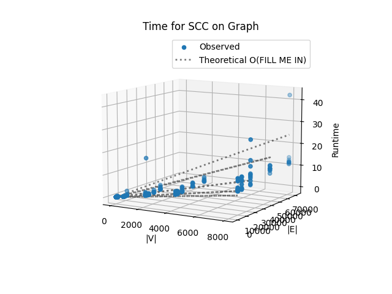
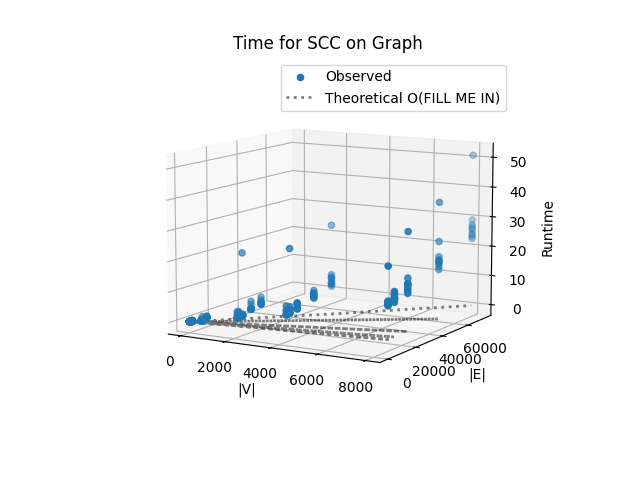

# Project Report - Network Analysis SCCs

## Baseline

### Design Experience

I spoke to my brother Jeshua who has knowledge of computer programming. I explained what graphs were, with their vertices
and edges. I then explained what a depth first search was and what a pre and postorder traversal was. I admittedly told him
I wasn't sure on how I was gonna implement it but I told him I would check the slides and textbook for pseudocode on how to 
implement a pre/postorder traversal. 

### Theoretical Analysis - Pre/Post Order Traversal

#### Time 
Let's analyze the time complexity of our prepost function

    def prepost(graph: GRAPH) -> list[dict[str, list[int]]]:
        visited = set()
        pre = {}
        post = {}
        time = 1
        trees = []
    
        def explore(v: str, nodes: set[str]):
            nonlocal time
    
            visited.add(v)
            nodes.add(v)
            pre[v] = time
            time += 1         
    
            for u in graph.get(v, []):          #O(E), this gets called for every edge
                if u not in visited:
                    explore(u, nodes)           #O(E)
            post[v] = time
            time += 1
    
        for v in graph:                         #O(V) for every vertice
            if v not in visited:
                tree_nodes = set()
                explore(v, tree_nodes)          #O(V) for every vertice, but implied since the for 
                                                        #loop so it doesn't add more complexity
                trees.append({u: [pre[u], post[u]] for u in tree_nodes})  #O(V) cost
    
    
        return trees

Everything other than the loops calling and exploring the vertices and their edges is constant, so we are looking at
O(V) + O(E), or O(|V| + |E|).
#### Space

Let's analyze the space complexity of the code:
    
    def prepost(graph: GRAPH) -> list[dict[str, list[int]]]:
    """
    Return a list of DFS trees.
    Each tree is a dict mapping each node label to a list of [pre, post] order numbers.
    The graph should be searched in order of the keys in the dictionary.
    """
    visited = set()           #O(V) for every node
    pre = {}                  #O(V)  
    post = {}                 #O(V)
    time = 1                    
    trees = []                #O(V)

    def explore(v: str, nodes: set[str]):
        nonlocal time

        visited.add(v)
        nodes.add(v)
        pre[v] = time
        time += 1

        for u in graph.get(v, []):
            if u not in visited:
                explore(u, nodes)
        post[v] = time
        time += 1

    for v in graph:
        if v not in visited:
            tree_nodes = set()       #O(V) worst case
            explore(v, tree_nodes)
            trees.append({u: [pre[u], post[u]] for u in tree_nodes})

    return trees
    
The total space complexity is just O(V). The amount of things stored depend majorly on what O(V) is. 

### Empirical Data

| Density | Size | Time (sec) |
|---------|------|------------|
| 0.25    | 10   | 0.01       |
| 0.25    | 50   | 0.057      |
| 0.25    | 100  | 0.153      |
| 0.25    | 500  | 0.49       |
| 0.25    | 2000 | 2.229      |
| 0.25    | 4000 | 3.959      |
| 0.25    | 8000 | 8.619      |
| 0.5     | 10   | 0.012      |
| 0.5     | 50   | 0.063      |
| 0.5     | 100  | 0.134      |
| 0.5     | 500  | 0.415      |
| 0.5     | 2000 | 3.587      |
| 0.5     | 4000 | 3.948      |
| 0.5     | 8000 | 9.556      |
| 1.0     | 10   | 0.008      |
| 1.0     | 50   | 0.034      |
| 1.0     | 100  | 0.07       |
| 1.0     | 500  | 0.382      |
| 1.0     | 2000 | 1.856      |
| 1.0     | 4000 | 4.371      |
| 1.0     | 8000 | 13.542     |
| 2.0     | 10   | 0.009      |
| 2.0     | 50   | 0.035      |
| 2.0     | 100  | 0.075      |
| 2.0     | 500  | 0.467      |
| 2.0     | 2000 | 2.107      |
| 2.0     | 4000 | 5.119      |
| 2.0     | 8000 | 11.882     |
| 3.0     | 10   | 0.009      |
| 3.0     | 50   | 0.039      |
| 3.0     | 100  | 0.103      |
| 3.0     | 500  | 0.773      |
| 3.0     | 2000 | 2.783      |
| 3.0     | 4000 | 5.384      |
| 3.0     | 8000 | 14.873     |

### Comparison of Theoretical and Empirical Results

- Theoretical order of growth: O(|V|+|E|)
- Empirical order of growth (if different from theoretical): Same

It overall looks like the empirical order of growth matches the theoretical order
## Core

### Design Experience

I once again spoke to my brother. I explained how strongly connected components are connected in a way they can go back and forth
between each other. I explained how to find them the reverse of a graph is used to start at sinks. I wasn't so sure why,
but I told him I thought it'd be because if we didn't start at sinks the DFS search would not find the SCC's at the sinks.

Later after reading the text book I found we start at sinks so SCC's are naturally found, since the explore algorythm will
stop naturally after an SCC has been completed. 

### Theoretical Analysis - SCC

#### Time 
Let's analyze the time complexity of the code

    def find_sccs(graph: GRAPH) -> list[set[str]]:
        """
        Return a list of the strongly connected components in the graph.
        The list should be returned in order of sink-to-source
        """
        reverse_graph = {}
        for node, edges in graph.items():      #O(V) traverses all nodes
            for edge in edges:                 #O(E) traverses all edges
                reverse_graph.setdefault(edge, []).append(node)
    
        trees = prepost(reverse_graph)
    
        post_order = {}
        for tree in trees:                      
            for node, (_, post) in tree.items():  #O(V) This line and the previous cause instructions to be executed for
                                                        #every node
                post_order[node] = post
    
        order = sorted(post_order, key=lambda v:post_order[v], reverse = True)        #O(VlogV) orders the nodes, goes through every node
    
        visited = set()
        sccs = []
    
        def explore(v: str, comp: set[str]):
            visited.add(v)
            comp.add(v)
            for u in graph.get(v, []):              #O(E) goes through every edge in v, for all edges
                if u not in visited:
                    explore(u, comp)
    
        for v in order:                             #O(V)goes over every node
            if v not in visited:
                comp = set()
                explore(v, comp)
                sccs.append(comp)
    
        return sccs

The time complexity overall is O(V + E + VlogV). The most lengthy instructions depend on the nodes and vertices, and everything else
just has a constant execution time. This is different from a standard SCC algorythm because we used a sorting function.

#### Space

    def find_sccs(graph: GRAPH) -> list[set[str]]:
        """
        Return a list of the strongly connected components in the graph.
        The list should be returned in order of sink-to-source
        """
        reverse_graph = {}                         #O(V + E), has an element for every node and edge
        for node, edges in graph.items():
            for edge in edges:
                reverse_graph.setdefault(edge, []).append(node)
    
        trees = prepost(reverse_graph)              #O(V + E)  from previous analysis 
    
        post_order = {}                             #O(V)
        for tree in trees:
            for node, (_, post) in tree.items():
                post_order[node] = post
    
        order = sorted(post_order, key=lambda v:post_order[v], reverse = True)   #O(V)
         
        visited = set()                         #O(V)
        sccs = []                               #O(V) on the worst case
    
        def explore(v: str, comp: set[str]):
            visited.add(v)
            comp.add(v)
            for u in graph.get(v, []):
                if u not in visited:
                    explore(u, comp)
    
        for v in order:
            if v not in visited:
                comp = set()
                explore(v, comp)
                sccs.append(comp)
    
        return sccs

The total space complexity is simply O(V + E)

### Empirical Data

| Density | Size | Time (sec) |
|---------|------|------------|
| 0.25    | 10   | 0.015      |
| 0.25    | 50   | 0.075      |
| 0.25    | 100  | 0.114      |
| 0.25    | 500  | 0.642      |
| 0.25    | 2000 | 2.992      |
| 0.25    | 4000 | 5.786      |
| 0.25    | 8000 | 12.683     |
| 0.5     | 10   | 0.013      |
| 0.5     | 50   | 0.053      |
| 0.5     | 100  | 0.136      |
| 0.5     | 500  | 0.708      |
| 0.5     | 2000 | 2.934      |
| 0.5     | 4000 | 7.822      |
| 0.5     | 8000 | 12.595     |
| 1.0     | 10   | 0.013      |
| 1.0     | 50   | 0.059      |
| 1.0     | 100  | 0.138      |
| 1.0     | 500  | 0.803      |
| 1.0     | 2000 | 4.96       |
| 1.0     | 4000 | 6.526      |
| 1.0     | 8000 | 16.392     |
| 2.0     | 10   | 0.016      |
| 2.0     | 50   | 0.064      |
| 2.0     | 100  | 0.177      |
| 2.0     | 500  | 0.881      |
| 2.0     | 2000 | 4.472      |
| 2.0     | 4000 | 8.438      |
| 2.0     | 8000 | 21.391     |
| 3.0     | 10   | 0.019      |
| 3.0     | 50   | 0.073      |
| 3.0     | 100  | 0.188      |
| 3.0     | 500  | 1.183      |
| 3.0     | 2000 | 5.158      |
| 3.0     | 4000 | 13.02      |
| 3.0     | 8000 | 28.142     |

### Comparison of Theoretical and Empirical Results

- Theoretical order of growth: O(V + E + VlogV)
- Empirical order of growth (if different from theoretical): O(VlogV)

It looks like the VlogV overpowers the rest of the big O complexity and the time complexity effectively becomes just
VlogV. If the sort function was removed it would fall back to O(V+E) but for my ease I left it that way. 
## Stretch 1

### Design Experience

I called my brother to discuss how I could implement stretch 1. I explained what an articulation point was, and how like on the 
graph on canvas at the articulation point C there is no cross edge between its subtrees or any back edge going back to C.
Only forward edges. These 3 are the classifications of edges for this design: Forward/tree, back and cross. 

### Articulation Points Discussion 

*Fill me in*

## Stretch 2

### Design Experience

*Fill me in*

### Dataset Description

*Fill me in*

### Findings Discussion

*Fill me in*

## Project Review

*Fill me in*
