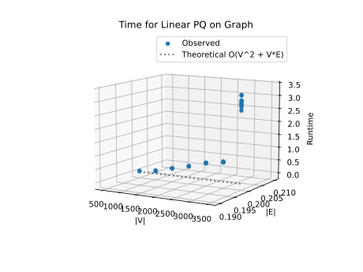
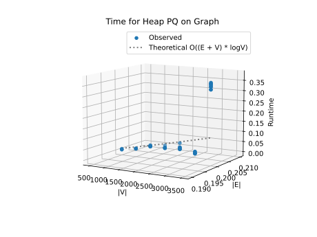

# Project Report - Network Routing

## Baseline

### Design Experience

I discussed my design with my little brother Jeshua. I explained to him how dijkstra's algorithm works. How it basically 
tries to find the shortest path first with only one hop, then with two, then with 3 and so forth. I explained how I will need to store
the shortest path and the previous node before reaching that shortest path somehow. 
I also explained how I would make my own priority queue using an array. I would make it a class of its own for easier readibility.  

### Theoretical Analysis - Dijkstra's With Linear PQ

#### Time 

Let's look at the code, starting with our linearPQ class:

    class LinearPQ:
        def __init__(self):
            self.data = []  # list of (item, priority)
    
        def insert(self, item, priority):
            self.data.append([item, priority])
    
        def delete_min(self):
            if not self.data:
                raise IndexError("queue is empty can't delete min.")
    
            min_index = 0
            for i in range(1, len(self.data)):                   #O(V)
                if self.data[i][1] < self.data[min_index][1]:
                    min_index = i
    
            item, priority = self.data.pop(min_index)
            return item, priority
    
        def decrease_key(self, item, new_priority):              #O(V*E) in the worst case
            for pair in self.data:
                if pair[0] == item:
                    pair[1] = new_priority
                    return
    
        def is_empty(self):
            return len(self.data) == 0
    
Now we look at the function to piece it together:

    def find_shortest_path_with_linear_pq(
            graph: dict[int, dict[int, float]],
            source: int,
            target: int
    ) -> tuple[list[int], float]:
        dist = {node: float('inf') for node in graph}    #O(V)
        prev = {node: None for node in graph}            #O(V)
    
        dist[source] = 0
    
        pq = LinearPQ()
        for node in graph:                               #O(V)
            pq.insert(node, dist[node])
    
        while not pq.is_empty():                         #O(V)
            current, current_dist = pq.delete_min()      #O(V^2) since it's within the loop. 
    
            if current_dist == float('inf'):
                break
    
            if current == target:
                break
    
            for edge, weight in graph[current].items(): #O(E)
                new_dist = dist[current] + weight
                if new_dist < dist[edge]:
                    dist[edge] = new_dist
                    prev[edge] = current
                    pq.decrease_key(edge, new_dist)      #O(V*E)
    
        if dist[target] == float('inf'):
            return [], float('inf')
    
        path = []
        node = target
        while node is not None:                           #O(V) at most 
            path.append(node)
            node = prev[node]
        
        path.reverse()                                      #O(V) 
        return path, dist[target]

This comes out to O(V) + O(V) + O(V^2) + O(V*E) + O(V) = O(V^2 + E*V).
It could be made to just O(V^2 +E) if decrease key was simplified but I think this will suffice. 

#### Space

Let's look at the code, starting with our linearPQ class:

    class LinearPQ:
        def __init__(self):
            self.data = []  # list of (item, priority)   #O(V)
    
        def insert(self, item, priority):
            self.data.append([item, priority])
    
        def delete_min(self):
            if not self.data:
                raise IndexError("queue is empty can't delete min.")
    
            min_index = 0
            for i in range(1, len(self.data)):                 
                if self.data[i][1] < self.data[min_index][1]:
                    min_index = i
    
            item, priority = self.data.pop(min_index)
            return item, priority
    
        def decrease_key(self, item, new_priority):           
            for pair in self.data:
                if pair[0] == item:
                    pair[1] = new_priority
                    return
    
        def is_empty(self):
            return len(self.data) == 0
    
Now we look at the function to piece it together:

    def find_shortest_path_with_linear_pq(
            graph: dict[int, dict[int, float]],
            source: int,
            target: int
    ) -> tuple[list[int], float]:
        dist = {node: float('inf') for node in graph}     #O(V)
        prev = {node: None for node in graph}           #O(V)
    
        dist[source] = 0
    
        pq = LinearPQ()
        for node in graph:                              
            pq.insert(node, dist[node])                  #O(V)
    
        while not pq.is_empty():                        
            current, current_dist = pq.delete_min()    
    
            if current_dist == float('inf'):
                break
    
            if current == target:
                break
    
            for edge, weight in graph[current].items():
                new_dist = dist[current] + weight         #O(1)
                if new_dist < dist[edge]:
                    dist[edge] = new_dist
                    prev[edge] = current
                    pq.decrease_key(edge, new_dist)     
    
        if dist[target] == float('inf'):
            return [], float('inf')
    
        path = []                                     #O(V)
        node = target
        while node is not None:                          
            path.append(node)
            node = prev[node]
        
        path.reverse()                                   
        return path, dist[target]

We can thus see that the total space complexity comes out to just O(V).

### Empirical Data - Dijkstra's With Linear PQ

| V    | Density | Time (sec) |
|------|---------|------------|
| 500  | 0.2     | 0.016      |
| 1000 | 0.2     | 0.074      |
| 1500 | 0.2     | 0.195      |
| 2000 | 0.2     | 0.307      |
| 2500 | 0.2     | 0.444      |
| 3000 | 0.2     | 0.525      |
| 3500 | 0.2     | 2.184      |

### Comparison of Theoretical and Empirical Results - Dijkstra's With Linear PQ

- Theoretical order of growth: O(V^2 + E*V)
- Empirical order of growth (if different from theoretical): Looks pretty good, I'd say it matches pretty well

The plot looks a little different. It looks like it does follow the theoretical analysis at first and then it blows up, probably because of some system limit. 

## Core

### Design Experience

I spoke to my brother again. I told him how I would implement pretty much the same algorithm but using a binary heap priority 
queue instead of a linear pq. I told him that a heap pq is like a christmas tree where the top term is always the smallest, 
and as the tree goes down the terms get bigger. Terms are inserted from left to right. In a binary heap pq there's only two 
sons for every term. The top term gets filled first, then the leftmost son, then the rightmost son, then the leftmost son of the 
leftmost son, and so forth. I explained how I can pretty much use the same function as with my linear dijkestra's algorithm, 
but just implement a different class for a heap pq. 

### Theoretical Analysis - Dijkstra's With Heap PQ

#### Time 

Let's look at the annotated code time analysis:

    #Binary heap
    class HeapPQ:
        def __init__(self):
            self.heap = []
            self.position = {}
    
        def is_empty(self):
            return len(self.heap) == 0
    
        def insert(self, item, priority):          #O(logn)
            self.heap.append([item,priority])
            index = len(self.heap) - 1
            self.position[item] = index
            self._bubble_up(index)
    
        def delete_min(self):                       #O(logn)
            if self.is_empty():
                raise IndexError("queue is empty can't delete min.")
    
            min_item = self.heap[0]
    
            last = self.heap.pop()
    
            del self.position[min_item[0]]
    
            if self.heap:
                self.heap[0] = last
                self.position[last[0]] = 0
                self._bubble_down(0)
    
            return min_item[0], min_item[1]
    
        def decrease_key(self, item, new_priority):         #O(logn)
            index = self.position[item]
            self.heap[index][1] = new_priority
            self._bubble_up(index)
    
        def _bubble_up(self, index):
            while index > 0:
                parent = (index - 1) // 2
                if self.heap[index][1] < self.heap[parent][1]:
                    self._swap(index, parent)
                    index = parent
                else:
                    break
    
        def _bubble_down(self, index):
            size = len(self.heap)
            while True:
                left = 2*index + 1
                right = 2*index + 2
                smallest = index
    
                if left < size and self.heap[left][1] < self.heap[smallest][1]:
                    smallest = left
    
                if right < size and self.heap[right][1] < self.heap[smallest][1]:
                    smallest = right
    
                if smallest != index:
                    self._swap(index, smallest)
                    index = smallest
                else:
                    break
    
        def _swap(self, i, j):
            self.position[self.heap[i][0]] = j
            self.position[self.heap[j][0]] = i
            self.heap[i], self.heap[j] = self.heap[j], self.heap[i]
    
    
    
    
    
    def find_shortest_path_with_heap(
            graph: dict[int, dict[int, float]],
            source: int,
            target: int
    ) -> tuple[list[int], float]:
        dist = {node: float('inf') for node in graph}  #O(V)
        prev = {node: None for node in graph}               #O(V)
    
        dist[source] = 0
    
        pq = HeapPQ()
        for node in graph:                               
            pq.insert(node, dist[node])                 #O(logV)
    
        while not pq.is_empty():                         #O(V)
            current, current_dist = pq.delete_min()     #O(logV)
    
            if current_dist == float('inf'):
                break
    
            if current == target:
                break
    
            for edge, weight in graph[current].items(): #O(E)
                new_dist = dist[current] + weight
                if new_dist < dist[edge]:
                    dist[edge] = new_dist
                    prev[edge] = current
                    pq.decrease_key(edge, new_dist)      #O(logV)
    
        if dist[target] == float('inf'):
            return [], float('inf')
    
        path = []
        node = target
        while node is not None:                           #O(V) at most 
            path.append(node)
            node = prev[node]
        
        path.reverse()                                      #O(V) 
        return path, dist[target]

We can see that the time complexity is V*logV + V*logV + E*logV + V. It comes out to O((V+E)logV)

#### Space

Let's look at the space complexity:

    #Binary heap
    class HeapPQ:
        def __init__(self):
            self.heap = []            #O(V)
            self.position = {}        #O(V)
    
        def is_empty(self):
            return len(self.heap) == 0
    
        def insert(self, item, priority):
            self.heap.append([item,priority])
            index = len(self.heap) - 1
            self.position[item] = index
            self._bubble_up(index)
    
        def delete_min(self):
            if self.is_empty():
                raise IndexError("queue is empty can't delete min.")
    
            min_item = self.heap[0]
    
            last = self.heap.pop()
    
            del self.position[min_item[0]]
    
            if self.heap:
                self.heap[0] = last
                self.position[last[0]] = 0
                self._bubble_down(0)
    
            return min_item[0], min_item[1]
    
        def decrease_key(self, item, new_priority):
            index = self.position[item]
            self.heap[index][1] = new_priority
            self._bubble_up(index)
    
        def _bubble_up(self, index):
            while index > 0:
                parent = (index - 1) // 2
                if self.heap[index][1] < self.heap[parent][1]:
                    self._swap(index, parent)
                    index = parent
                else:
                    break
    
        def _bubble_down(self, index):
            size = len(self.heap)
            while True:
                left = 2*index + 1
                right = 2*index + 2
                smallest = index
    
                if left < size and self.heap[left][1] < self.heap[smallest][1]:
                    smallest = left
    
                if right < size and self.heap[right][1] < self.heap[smallest][1]:
                    smallest = right
    
                if smallest != index:
                    self._swap(index, smallest)
                    index = smallest
                else:
                    break
    
        def _swap(self, i, j):
            self.position[self.heap[i][0]] = j
            self.position[self.heap[j][0]] = i
            self.heap[i], self.heap[j] = self.heap[j], self.heap[i]
    
    
    
    
    
    def find_shortest_path_with_heap(
            graph: dict[int, dict[int, float]],
            source: int,
            target: int
    ) -> tuple[list[int], float]:
        """
        Find the shortest (least-cost) path from `source` to `target` in `graph`
        using the heap-based algorithm.
    
        Return:
            - the list of nodes (including `source` and `target`)
            - the cost of the path
        """
        dist = {node: float('inf') for node in graph}     #O(V)
        prev = {node: None for node in graph}               #O(V)
    
        dist[source] = 0
    
        pq = HeapPQ()
        for node in graph:                              #O(V)
            pq.insert(node, dist[node])
    
        while not pq.is_empty():
            current, current_dist = pq.delete_min()
    
            if current_dist == float('inf'):
                break
    
            if current == target:
                break
    
            for edge, weight in graph[current].items():
                new_dist = dist[current] + weight
                if new_dist < dist[edge]:
                    dist[edge] = new_dist
                    prev[edge] = current
                    pq.decrease_key(edge, new_dist)
    
        if dist[target] == float('inf'):
            return [], float('inf')
    
        path = []                   #O(V) at most but unlikely
        node = target
        while node is not None:
            path.append(node)
            node = prev[node]
    
        path.reverse()
        return path, dist[target]

The total space complexity comes out to O(V)

### Empirical Data - Dijkstra's With Heap PQ

| V    | Density | Time (sec) |
|------|---------|------------|
| 500  | 0.2     | 0.006      |
| 1000 | 0.2     | 0.019      |
| 1500 | 0.2     | 0.041      |
| 2000 | 0.2     | 0.042      |
| 2500 | 0.2     | 0.044      |
| 3000 | 0.2     | 0.031      |
| 3500 | 0.2     | 0.358      |

### Comparison of Theoretical and Empirical Results - Dijkstra's With Heap PQ

- Theoretical order of growth:  O((V+E)logV)
- Empirical order of growth: Not sure what I'm looking at. Looks like a weird version of -V^2 with a huge spike at the
end.

This is the plot:

The empirical data doesn't match the theoretical. I double-checked the functions and the importing of the data and it all
looks good. I think the difference might be just system noise since the runtimes are so small. Maybe there's some other
unseen system function that makes it run at an unexpected time. 

### Relative Performance Of Linear versus Heap PQ Performance

The Heap PQ implementation of dijkstra's algorithm is undoubtedly faster. It is apparent from the bigO analysis, but
undeniable when looking at the empirical data. The difference is like night and day. And it is all thanks to the fact
that the delete_min function in the heap PQ is faster than the one in the linear PQ. 

## Stretch 1

### Design Experience

I told my brother I have no idea how to implement this part. I will try and use the same functions for runtime linear pq and runtime heap pq.
Then I will try to use the existing plot file to make the plots I need. 

### Empirical Data

| V    | Density | heap time (sec) | linear PQ time (sec) |
|------|---------|-----------------|----------------------|
| 500  | .6      | 0.012           | 0.037                |
| 1000 | .6      | 0.036           | 0.184                |
| 1500 | .6      | 0.046           | 0.423                |
| 2000 | .6      | 0.045           | 0.52                 |
| 2500 | .6      | 0.2             | 1.841                |
| 3000 | .6      | 0.651           | 3.414                |
| 3500 | .6      | 0.676           | 4.853                |

| V    | Density | heap time (sec) | linear PQ time (sec) |
|------|---------|-----------------|----------------------|
| 500  | 1       | 0.009           | 0.045                |
| 1000 | 1       | 0.016           | 0.15                 |
| 1500 | 1       | 0.153           | 0.831                |
| 2000 | 1       | 0.144           | 1.349                |
| 2500 | 1       | 0.222           | 1.207                |
| 3000 | 1       | 0.026           | x                    |
| 3500 | 1       | 0.945           | x                    |

### Plot

### Discussion

*Fill me in*

## Stretch 2

### Design Experience

*Fill me in*

### Provided Graph Generation Algorithm Explanation

*Fill me in*

### Selected Graph Generation Algorithm Explanation

*Fill me in*

#### Screenshots of Working Graph Generation Algorithm

## Project Review

*Fill me in*

