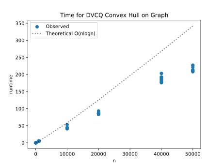

# Project Report - Convex Hull

## Baseline

### Design Discussion

I spoke with my brother Jeshua about my design. My base case is that I have either a single point, or a line, or a triangle.
To merge both hulls I will follow the same algorithm from the homework, starting
at the rightmost dot on the left hull, moving to higher ones until the angle can't be more negative,
then the opposite on the right side, and then the opposite again below. I will use a 
list of tuples to represent the points. 

### Theoretical Analysis - Convex Hull Divide-and-Conquer

#### Time 

Let's look at the annotated code for the time complexity:

    def compute_hull_dvcq(points: list[tuple[float, float]]) -> list[tuple[float, float]]:
        points = sorted(points, key=lambda p: (p[0], p[1]))    #O(nlogn)
    
        return _compute_hull_recursive(points)              #T(n)
    
    def _compute_hull_recursive(points):
        if len(points) <= 3:
            pts = sorted(points)
    
            if len(pts) <= 1:
                return pts
    
            if len(pts) == 2:
                return pts
    
            o, a, b = pts
            turn = cross(o, a, b)
    
            if turn > 0:
                return [o, a, b]
            elif turn < 0:
                return [o, b, a]
            else:
                return [o, b]
    
        mid = len(points) // 2                  #O(n)
        left_points = points[:mid]
        right_points = points[mid:]
    
        left_hull = _compute_hull_recursive(left_points)          #2T(n/2)
        right_hull = _compute_hull_recursive(right_points)          #2T(n/2)
    
        return merge_hulls(left_hull, right_hull)           #O(n)
    
    
    def merge_hulls(left, right):
        if not left:
            return right
        if not right:
            return left
    
        nL = len(left)
        nR = len(right)
    
        i = max(range(nL), key=lambda k: left[k][0])       #O(n)
    
        j = min(range(nR), key=lambda k: right[k][0])       #O(n)
    
        done = False
        while not done:
            done = True
    
            while cross(right[j], left[i], left[(i - 1) % nL]) >= 0:   #O(n)
                i = (i - 1) % nL
    
            while cross(left[i], right[j], right[(j + 1) % nR]) <= 0:   #O(n)
                j = (j + 1) % nR
                done = False
    
        upper_i = i
        upper_j = j
    
        i = max(range(nL), key=lambda k: left[k][0])
        j = min(range(nR), key=lambda k: right[k][0])
    
        done = False
        while not done:
            done = True
    
            while cross(right[j], left[i], left[(i + 1) % nL]) <= 0:   #O(n)
                i = (i + 1) % nL
    
            while cross(left[i], right[j], right[(j - 1) % nR]) >= 0:    #O(n)
                j = (j - 1) % nR
                done = False
    
        lower_i = i
        lower_j = j
    
        hull = []
    
        idx = upper_i
        hull.append(left[idx])
        while idx != lower_i:                                           #O(n)
            idx = (idx - 1) % nL
            hull.append(left[idx])
    
        idx = lower_j
        hull.append(right[idx])
        while idx != upper_j:
            idx = (idx - 1) % nR
            hull.append(right[idx])
    
        if len(hull) < 3:
            return hull
    
        total = 0
        for i in range(len(hull)):                                      #O(n)
            x1, y1 = hull[i]
            x2, y2 = hull[(i + 1) % len(hull)]
            total += (x2 - x1) * (y2 + y1)
    
        if total > 0:
            hull = hull[::-1]
    
        return hull

T(n) = 2T(n/2) + O(n) is what we are looking at. n^Log2(2) = n^1, which is equal to O(n). The master theorem indicates
that since both n^log2(2) and n are equal, the total time complexity comes out to be O(nlogn).

#### Space

Now let's look at annotated code for the space complexity:

    def compute_hull_dvcq(points: list[tuple[float, float]]) -> list[tuple[float, float]]:
        points = sorted(points, key=lambda p: (p[0], p[1]))         #O(n)   
    
        return _compute_hull_recursive(points)             
    
    def _compute_hull_recursive(points):
        if len(points) <= 3:
            pts = sorted(points)                            #O(n)
    
            if len(pts) <= 1:
                return pts
    
            if len(pts) == 2:
                return pts
    
            o, a, b = pts                
            turn = cross(o, a, b)
    
            if turn > 0:
                return [o, a, b]
            elif turn < 0:
                return [o, b, a]
            else:
                return [o, b]
    
        mid = len(points) // 2                            
        left_points = points[:mid]                  #O(n)/2
        right_points = points[mid:]                 #O(n)/2
    
        left_hull = _compute_hull_recursive(left_points)        
        right_hull = _compute_hull_recursive(right_points)         
    
        return merge_hulls(left_hull, right_hull)           
    
    
    def merge_hulls(left, right):
        if not left:
            return right
        if not right:
            return left
    
        nL = len(left)
        nR = len(right)
    
        i = max(range(nL), key=lambda k: left[k][0])      
    
        j = min(range(nR), key=lambda k: right[k][0])      
    
        done = False
        while not done:
            done = True
    
            while cross(right[j], left[i], left[(i - 1) % nL]) >= 0:  
                i = (i - 1) % nL
    
            while cross(left[i], right[j], right[(j + 1) % nR]) <= 0:   
                j = (j + 1) % nR
                done = False
    
        upper_i = i
        upper_j = j
    
        i = max(range(nL), key=lambda k: left[k][0])
        j = min(range(nR), key=lambda k: right[k][0])
    
        done = False
        while not done:
            done = True
    
            while cross(right[j], left[i], left[(i + 1) % nL]) <= 0:  
                i = (i + 1) % nL
    
            while cross(left[i], right[j], right[(j - 1) % nR]) >= 0:   
                j = (j - 1) % nR
                done = False
    
        lower_i = i
        lower_j = j
    
        hull = []                               #O(n) at worst, less than that on average
    
        idx = upper_i
        hull.append(left[idx])
        while idx != lower_i:                                          
            idx = (idx - 1) % nL
            hull.append(left[idx])
    
        idx = lower_j
        hull.append(right[idx])
        while idx != upper_j:
            idx = (idx - 1) % nR
            hull.append(right[idx])
    
        if len(hull) < 3:
            return hull
    
        total = 0
        for i in range(len(hull)):                                     
            x1, y1 = hull[i]
            x2, y2 = hull[(i + 1) % len(hull)]
            total += (x2 - x1) * (y2 + y1)
    
        if total > 0:
            hull = hull[::-1]
    
        return hull

The total space complexity comes out to #O(n).

## Core

### Design Discussion

No core tests failed

### Empirical Data - Convex Hull Divide-and-Conquer

| N     | time (ms) |
|-------|-----------|
| 10    | 0.029     |
| 100   | 0.331     |
| 1000  | 4.694     |
| 10000 | 44.121    |
| 20000 | 86.321    |
| 40000 | 186.633   |
| 50000 | 215.033   |

### Comparison of Theoretical and Empirical Results

- Theoretical order of growth: O(nlogn)
- Empirical order of growth (if different from theoretical): Looks the same

They match very well. Towards the bigger numbers the empirical data seems to be faster than
the theoretical, probably because the worst case scenario doesn't always happen and python
runs some optimization. 

## Stretch 1

### Design Discussion

*Fill me in*

### Chosen Convex Hull Implementation Description

*Fill me in*

### Empirical Data

| N     | time (ms) |
|-------|-----------|
| 10    |           |
| 100   |           |
| 1000  |           |
| 10000 |           |
| 20000 |           |
| 40000 |           |
| 50000 |           |

### Comparison of Chosen Algorithm with Divide-and-Conquer Convex Hull

#### Algorithmic Differences

*Fill me in*

#### Performance Differences

*Fill me in*

## Stretch 2

### Design Discussion

*Fill me in*

### Dataset 

*Fill me in*

## Project Review

*Fill me in*

