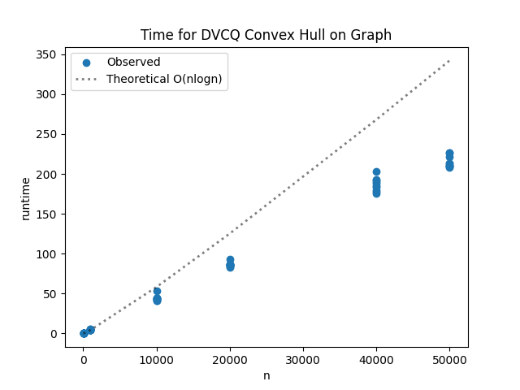
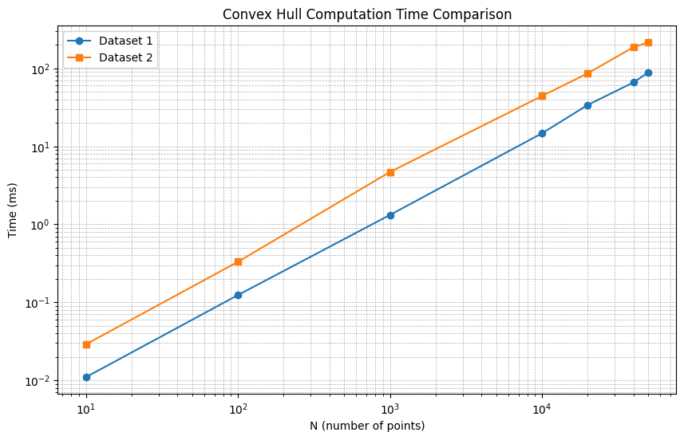

# Project Report - Convex Hull

## Baseline

### Design Discussion

I spoke with my brother Jeshua about my design. My base case is that I have either a single point, or a line, or a triangle.
To merge both hulls I will follow the same algorithm from the homework, starting
at the rightmost dot on the left hull, moving to higher ones until the angle can't be more negative,
then the opposite on the right side, and then the opposite again below. I will use a 
list of tuples to represent the points. 

### Theoretical Analysis - Convex Hull Divide-and-Conquer

#### Time 

Let's look at the annotated code for the time complexity:

    def compute_hull_dvcq(points: list[tuple[float, float]]) -> list[tuple[float, float]]:
        points = sorted(points, key=lambda p: (p[0], p[1]))    #O(nlogn)
    
        return _compute_hull_recursive(points)              #T(n)
    
    def _compute_hull_recursive(points):
        if len(points) <= 3:
            pts = sorted(points)
    
            if len(pts) <= 1:
                return pts
    
            if len(pts) == 2:
                return pts
    
            o, a, b = pts
            turn = cross(o, a, b)
    
            if turn > 0:
                return [o, a, b]
            elif turn < 0:
                return [o, b, a]
            else:
                return [o, b]
    
        mid = len(points) // 2                  #O(n)
        left_points = points[:mid]
        right_points = points[mid:]
    
        left_hull = _compute_hull_recursive(left_points)          #2T(n/2)
        right_hull = _compute_hull_recursive(right_points)          #2T(n/2)
    
        return merge_hulls(left_hull, right_hull)           #O(n)
    
    
    def merge_hulls(left, right):
        if not left:
            return right
        if not right:
            return left
    
        nL = len(left)
        nR = len(right)
    
        i = max(range(nL), key=lambda k: left[k][0])       #O(n)
    
        j = min(range(nR), key=lambda k: right[k][0])       #O(n)
    
        done = False
        while not done:
            done = True
    
            while cross(right[j], left[i], left[(i - 1) % nL]) >= 0:   #O(n)
                i = (i - 1) % nL
    
            while cross(left[i], right[j], right[(j + 1) % nR]) <= 0:   #O(n)
                j = (j + 1) % nR
                done = False
    
        upper_i = i
        upper_j = j
    
        i = max(range(nL), key=lambda k: left[k][0])
        j = min(range(nR), key=lambda k: right[k][0])
    
        done = False
        while not done:
            done = True
    
            while cross(right[j], left[i], left[(i + 1) % nL]) <= 0:   #O(n)
                i = (i + 1) % nL
    
            while cross(left[i], right[j], right[(j - 1) % nR]) >= 0:    #O(n)
                j = (j - 1) % nR
                done = False
    
        lower_i = i
        lower_j = j
    
        hull = []
    
        idx = upper_i
        hull.append(left[idx])
        while idx != lower_i:                                           #O(n)
            idx = (idx - 1) % nL
            hull.append(left[idx])
    
        idx = lower_j
        hull.append(right[idx])
        while idx != upper_j:
            idx = (idx - 1) % nR
            hull.append(right[idx])
    
        if len(hull) < 3:
            return hull
    
        total = 0
        for i in range(len(hull)):                                      #O(n)
            x1, y1 = hull[i]
            x2, y2 = hull[(i + 1) % len(hull)]
            total += (x2 - x1) * (y2 + y1)
    
        if total > 0:
            hull = hull[::-1]
    
        return hull

T(n) = 2T(n/2) + O(n) is what we are looking at. n^Log2(2) = n^1, which is equal to O(n). The master theorem indicates
that since both n^log2(2) and n are equal, the total time complexity comes out to be O(nlogn).

#### Space

Now let's look at annotated code for the space complexity:

    def compute_hull_dvcq(points: list[tuple[float, float]]) -> list[tuple[float, float]]:
        points = sorted(points, key=lambda p: (p[0], p[1]))         #O(n)   
    
        return _compute_hull_recursive(points)             
    
    def _compute_hull_recursive(points):
        if len(points) <= 3:
            pts = sorted(points)                            #O(n)
    
            if len(pts) <= 1:
                return pts
    
            if len(pts) == 2:
                return pts
    
            o, a, b = pts                
            turn = cross(o, a, b)
    
            if turn > 0:
                return [o, a, b]
            elif turn < 0:
                return [o, b, a]
            else:
                return [o, b]
    
        mid = len(points) // 2                            
        left_points = points[:mid]                  #O(n)/2
        right_points = points[mid:]                 #O(n)/2
    
        left_hull = _compute_hull_recursive(left_points)        
        right_hull = _compute_hull_recursive(right_points)         
    
        return merge_hulls(left_hull, right_hull)           
    
    
    def merge_hulls(left, right):
        if not left:
            return right
        if not right:
            return left
    
        nL = len(left)
        nR = len(right)
    
        i = max(range(nL), key=lambda k: left[k][0])      
    
        j = min(range(nR), key=lambda k: right[k][0])      
    
        done = False
        while not done:
            done = True
    
            while cross(right[j], left[i], left[(i - 1) % nL]) >= 0:  
                i = (i - 1) % nL
    
            while cross(left[i], right[j], right[(j + 1) % nR]) <= 0:   
                j = (j + 1) % nR
                done = False
    
        upper_i = i
        upper_j = j
    
        i = max(range(nL), key=lambda k: left[k][0])
        j = min(range(nR), key=lambda k: right[k][0])
    
        done = False
        while not done:
            done = True
    
            while cross(right[j], left[i], left[(i + 1) % nL]) <= 0:  
                i = (i + 1) % nL
    
            while cross(left[i], right[j], right[(j - 1) % nR]) >= 0:   
                j = (j - 1) % nR
                done = False
    
        lower_i = i
        lower_j = j
    
        hull = []                               #O(n) at worst, less than that on average
    
        idx = upper_i
        hull.append(left[idx])
        while idx != lower_i:                                          
            idx = (idx - 1) % nL
            hull.append(left[idx])
    
        idx = lower_j
        hull.append(right[idx])
        while idx != upper_j:
            idx = (idx - 1) % nR
            hull.append(right[idx])
    
        if len(hull) < 3:
            return hull
    
        total = 0
        for i in range(len(hull)):                                     
            x1, y1 = hull[i]
            x2, y2 = hull[(i + 1) % len(hull)]
            total += (x2 - x1) * (y2 + y1)
    
        if total > 0:
            hull = hull[::-1]
    
        return hull

The total space complexity comes out to #O(n).

## Core

### Design Discussion

No core tests failed

### Empirical Data - Convex Hull Divide-and-Conquer

| N     | time (ms) |
|-------|-----------|
| 10    | 0.029     |
| 100   | 0.331     |
| 1000  | 4.694     |
| 10000 | 44.121    |
| 20000 | 86.321    |
| 40000 | 186.633   |
| 50000 | 215.033   |

### Comparison of Theoretical and Empirical Results

- Theoretical order of growth: O(nlogn)
- Empirical order of growth (if different from theoretical): Looks the same

They match very well. Towards the bigger numbers the empirical data seems to be faster than
the theoretical, probably because the worst case scenario doesn't always happen and python
runs some optimization. 

## Stretch 1

### Design Discussion

I spoke with my brother once again, after counseling with chatgpt. I asked the ai tool about some different algorithms and
ended up settling with the monotone chain algorithm. I will have ai help me write the algorithm, I will study it and learn everything
about it and I will debug it myself since ai is bound to fail in one way or another. 

### Chosen Convex Hull Implementation Description

I chose the monotone chain algorithm, also known as Andrew's Algorithm. The main idea behind this algorithm is to 
lexicographically sort the points, and then reconstruct the hull from the lower half first, and then the upper half, using
the cross function to check if the subsequent points are part of the hull or not. Points which are part of the hull are added
to an array with the upper or lower part of the hull, and then they are merged. 

As we said the algorithm starts with a lexicographic sort. This sorts all the points in order of increasing x values,
and if there is any tie between x values they are sorted in increasing y values. This ensures if the point list is 
read from beginning to end, it will be read from left to right, which is essential for the algorithm. 

Then the algorithm proceeds to build the lower part of the hull. It creates a list to append the hull points to. 
It starts iterating through the points from left to right, adding each point until there is at least two points in the 
lower list. Once there are at least two points in the lower list, the third point is used to check if the second point is a 
valid point of the hull.  If the algorithm determines it the second point was not valid, it gets removed and the third gets
added to be compared again. If the second point was valid, it remains in the list and the third point gets added to be compared
with the subsequent point. 

The algorithm does this by using the cross formula provided. The cross formula essentially checks if three points form a left turn
or a right turn. For the lower hull we check if the point being evaluated creates a right turn when compared to the next point. 
It would look like this:

    --> -->  |
             v

If we encounter a right turn in the lower hull, it must mean that the middle
point is not part of the convex hull. This is because the convex hull needs to include
all possible lines between points, and if there is a right turn from a to b to c
in the lower hull, a direct line must be possible between a and c. 

The algorithm also pops points that are collinear. They would look like this:

    ^
    |
    ^
    |
    ^
    |
This is because if a b and c are collinear, b is irrelevant and a single line
could connect both a and c. 

Whether the turn created by 3 points is a left turn, a right turn or just
collinear is found with the cross formula, which returns positive, negative or 0 for 
each value respectively. 

The algorithm continues iterating through all points of the hull from left to right
for the lower hull, popping invalid points and adding only valid points which make a 
left turn or go straight horizontally. 

It goes through all the points from left to right, but because of the cross function check it only 
records the points corresponding to the lower part of the hull. 

We then do the same process for the upper hull, except we use a reverse list of the points in order to iterate from the points
from the right to the left. The algorithm proceeds to iterate through the points again, checking that there is only
left turns or straight horizontal lines, no invalid points like with the lower hull. 

Both the lower and upper hull construction check that no right or collinear turns are generated, only left turns. 
The lower hull iterates all points from left to right, and the right hull construction iterates all points from
right to left. 
This essentially ensures the convex hull is generated with the points going counterclockwise. 

After both hulls are constructed, the upper and lower hulls are merged. Since both hulls were constructed iterating
through all the points, the first and last point of both hulls are bound to be duplicate. We simply merge both hulls 
up to and excluding their last value so no points are repeated, and what results is our final convex hull.

### Empirical Data

| N     | time (ms) |
|-------|-----------|
| 10    | 0.011     |
| 100   | 0.124     |
| 1000  | 1.32      |
| 10000 | 14.678    |
| 20000 | 33.933    |
| 40000 | 65.976    |
| 50000 | 88.414    |

### Comparison of Chosen Algorithm with Divide-and-Conquer Convex Hull

#### Algorithmic Differences

Both convex hull algorithms have a time complexity of O(nlogn). They both start with a sort that contributes to this time
complexity. 

The monotone chain algorithm doesn't use recursion like the DVCQ algorithm. 

The monotone chain algorithm is also much simpler coding. 

#### Performance Differences

Dataset 1 corresponds to the Monotone Chain Algorithm, Dataset 2 corresponds to the DVCQ algorithm

Looking at the empirical data we can see that both algorithms have a similar order of growth, but it seems the monotone
chain algorithm has a smaller constant runtime than the DVCQ algorithm, since its runtime values grow in similar proportion
but are generally smaller than the DVCQ algorithm.

## Stretch 2

### Design Discussion

*Fill me in*

### Dataset 

*Fill me in*

## Project Review

*Fill me in*

