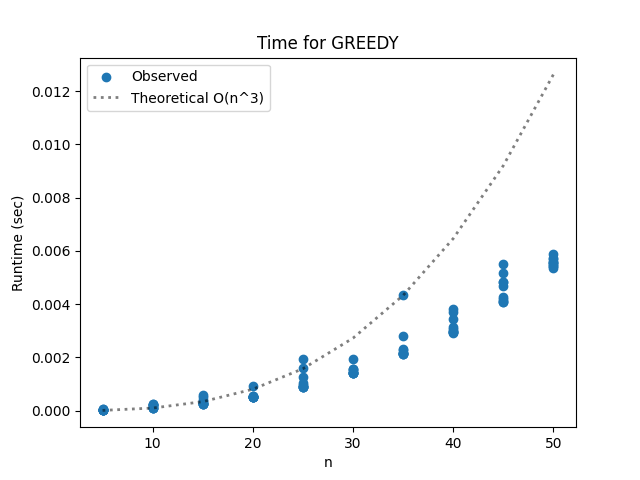
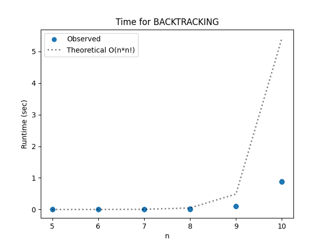
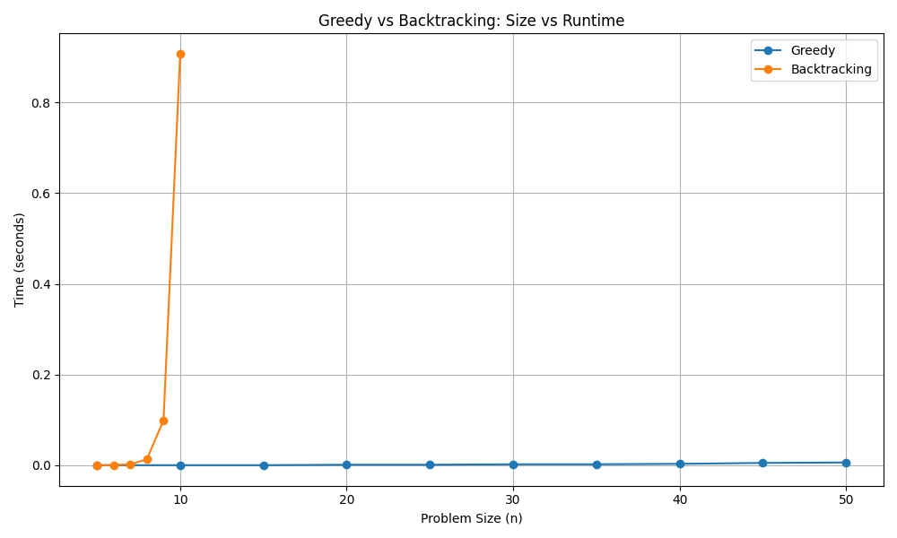

# Project Report - Backtracking

## Baseline

### Design Experience

I spoke to my brother Jeshua about my design. I understand backtracking and greedy
algorithms pretty well. For the greedy tour baseline requirements 
I will follow the instructions on the lab page and always
pick the smallest path to follow. Obviously this will lead to dead ends,
but the timer provided will help me exit the current branch if I've arrived at a 
dead end. I'll use a set to keep track of unvisited nodes, and store a solution if it
is the best I've found and also if all nodes were visited. 

### Theoretical Analysis - Greedy

#### Time 

Let's look at the annotated code:

    def greedy_tour(edges: list[list[float]], timer: Timer) -> list[SolutionStats]:
        n = len(edges)
        solutions = []
        best_score = math.inf
    
        #loop to iterate through different paths
        for i in range(n):                       #O(n), for every node 
            unvisited = set(range(n))
            tour = [i]
            unvisited.remove(i)
            while unvisited and not timer.time_out():  #O(n) in the worst case
                current = tour[-1]
                next_node = min(unvisited, key=lambda j: edges[current][j])   #O(n) for every node 
                tour.append(next_node)
                unvisited.remove(next_node)
            score = score_tour(tour, edges)  #O(n) time
    
            if not math.isinf(score):
                if best_score > score:
                    solutions.append(SolutionStats(tour, score, timer.time(), 0, 0, 0, 0, 0))
                    best_score = score
    
        return solutions

Total time complexity becomes O(n^3)

#### Space

Let's look at the annotated code for time complexity:

    def greedy_tour(edges: list[list[float]], timer: Timer) -> list[SolutionStats]:
        n = len(edges)
        solutions = []         #O(n) SolutionStats stored at worst
        best_score = math.inf
    
        #loop to iterate through different paths
        for i in range(n):
            unvisited = set(range(n))    #O(n)
            tour = [i]                      #O(n) at worst
            unvisited.remove(i)
            while unvisited and not timer.time_out():   
                current = tour[-1]
                next_node = min(unvisited, key=lambda j: edges[current][j])
                tour.append(next_node)
                unvisited.remove(next_node)
            score = score_tour(tour, edges)
    
            if not math.isinf(score):
    
                if best_score > score:
                    solutions.append(SolutionStats(tour, score, timer.time(), 0, 0, 0, 0, 0))  #O(n) for every solutionStats
                    best_score = score
    
        return solutions

Because every solution stat can hold up to O(n) complexity, and we can store up to O(n) solutions, space complexity is 
O(n^2)

### Empirical Data - Greedy

| Size | Reduction | Time (sec) |
|------|-----------|------------|
| 5    | 0         | 0.0        |
| 10   | 0         | 0.0        |
| 15   | 0         | 0.0        |
| 20   | 0         | 0.001      |
| 25   | 0         | 0.001      |
| 30   | 0         | 0.002      |
| 35   | 0         | 0.002      |
| 40   | 0         | 0.003      |
| 45   | 0         | 0.005      |
| 50   | 0         | 0.006      |

### Comparison of Theoretical and Empirical Results - Greedy

- Theoretical order of growth: O(n^3)
- Empirical order of growth (if different from theoretical): Looks like O(n^2)

There is a slight difference between the values in the empirical data and the theoretical order of growth. This could
simply be due to noise considering how small the n values are. If we compared the runtimes of bigger n values the data
could come closer to the theoretical. 

## Core

### Design Experience

I spoke to my brother again. I will use a stack to keep track of the current step in the backtracking algorithm. 
I will place a set of unvisited nodes in this stack along with a partial path represented by a list. I will store
every partial path with its respective unvisited set in the stack, and I will store a path in the solutions list
if the size of the path is the same as the number of nodes(meaning all nodes were visited).

### Theoretical Analysis - Backtracking

#### Time 
Let's look at the annotated code for time complexity:

    def backtracking(edges: list[list[float]], timer: Timer) -> list[SolutionStats]:
        n = len(edges)
        solutions = []
        best_score = math.inf
        stack = [([0], set(range(1, n)))]
    
        while stack and not timer.time_out():  #Runs up to O(n!) times, once for every possible node on the stack
            path, unvisited = stack.pop()    
    
            if len(path) == n:
                score = score_tour(path, edges)        #O(n) 
                if best_score > score:
                    solutions.append(SolutionStats(path, score, timer.time(), 0, 0, 0, 0, 0))
                    best_score = score
    
            else:
                for node in unvisited:          #O(n) times again, within O(n!)
                    new_path = path + [node]
                    new_unvisited = unvisited - {node}    #set lookup is O(1)
                    stack.append((new_path,new_unvisited))
    
        return solutions

Calculating the score takes time, but becomes overshadowed by the while loop and the branching into partial paths.
Total time complexity comes out to O(n!) * O(n) = O(n*n!).

#### Space
Let's look at the annotated code for space complexity: 
   
    def backtracking(edges: list[list[float]], timer: Timer) -> list[SolutionStats]:
        n = len(edges)
        solutions = []                 #O(n) at worst
        best_score = math.inf
        stack = [([0], set(range(1, n)))]      #Stores O(n!) values up to O(n) times, so O(n*n!)
    
        while stack and not timer.time_out():
            path, unvisited = stack.pop()
    
            if len(path) == n:
                score = score_tour(path, edges)
                if best_score > score:
                    solutions.append(SolutionStats(path, score, timer.time(), 0, 0, 0, 0, 0)) 
                    best_score = score
    
            else:
                for node in unvisited:
                    new_path = path + [node]                 #O(n)
                    new_unvisited = unvisited - {node}          #O(n)
                    stack.append((new_path,new_unvisited))
    
        return solutions

Everything becomes overshadowed by the stack storing all the partial paths and their respective visited nodes,
space complexity comes out to O(n*n!)

### Empirical Data - Backtracking

| Size | Reduction | Time (sec) |
|------|-----------|------------|
| 5    | 0         | 0.0        |
| 6    | 0         | 0.0        |
| 7    | 0         | 0.002      |
| 8    | 0         | 0.013      |
| 9    | 0         | 0.099      |
| 10   | 0         | 0.907      |

Started timing out at 11

### Comparison of Theoretical and Empirical Results - Backtracking

- Theoretical order of growth: O(n*n!)
- Empirical order of growth (if different from theoretical): the same

Looks like theoretical matches empirical well. You can see how they both start shooting up at the same place

### Greedy v Backtracking

I've come to the conclusion that greedy is a faster algorithm for this problem, while using backtracking is much 
slower but also more thorough. Greedy may not always find the absolute cheapest path, no matter how much time it has,
whereas with backtracking the algorithm will find the best path given enough time and patience

### Water Bottle Scenario 

#### Scenario 1

Backtracking

This algorithm looks for the best possible value without ignoring or pruning any branches. This will ensure that 
absolutely every single path combination is observed and the boss receives the absolute best.

#### Scenario 2

Greedy

The boss needs a solution quickly and is too concerned over the cost of the sequences. Greedy will find quick, reasonable
solutions before any backtracking algorithm. 

#### Scenario 3

Backtracking with BSSF

Just like with scenario 1, my boss wants the best solution possible. The only difference is that there are some road closures,
which is similar to pruning branches with BSSF. I can treat the closed roads as pruned branches and this algorithm will
deliver the best solution. 

## Stretch 1

### Design Experience

*Fill me in*

### Demonstrate BSSF Backtracking Works Better than No-BSSF Backtracking 

*Fill me in*

### BSSF Backtracking v Backtracking Complexity Differences

*Fill me in*

### Time v Solution Cost

*Fill me in*

## Stretch 2

### Design Experience

*Fill me in*

### Cut Tree

*Fill me in*

### Plots 

*Fill me in*

## Project Review

*Fill me in*
