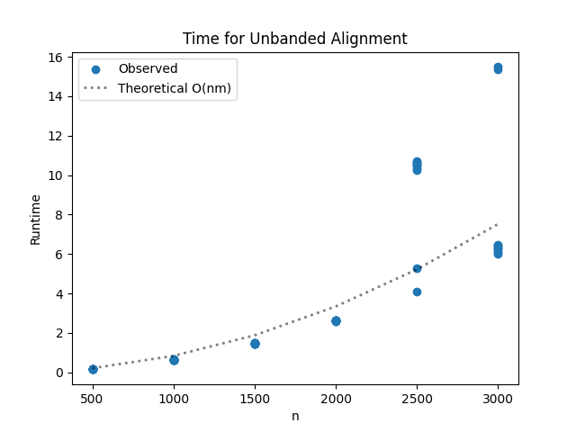
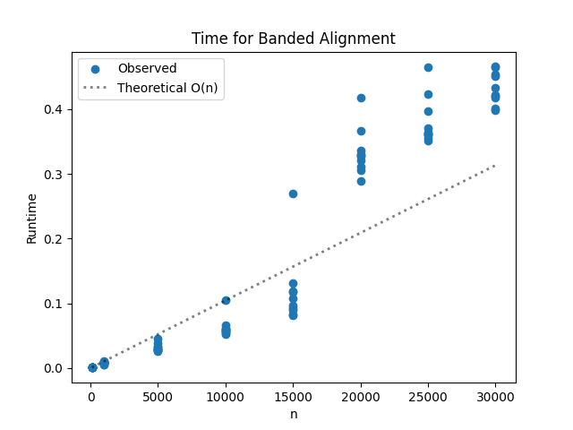

# Project Report - Alignment

## Baseline

### Design Experience

I spoke with my brother Jeshua. My plan is to use a list of a list to create the matrix. The way that it works is that
for unbanded alignment the first column and row are initialized to multiples of the indel penalty, 
and then each subsequent square is filled by taking the smallest value out of the upper, left or diagonal values in the
matrix, and then adding the indel penalty for l or r, or adding the match award or sub penalty for diagonal values. 
While all of this is going on another matrix of the same dimensions is being filled with the trace of where the value at
a current box came from. I'll use L, D, U to represent the three possible trace values. 


### Theoretical Analysis - Unrestricted Alignment

#### Time

Let's look at the annotated code for the time complexity:

    def align(
        seq1: str,
        seq2: str,
        match_award=-3,
        indel_penalty=5,
        sub_penalty=1,
        banded_width=-1,
        gap="-",
    ) -> tuple[float, str | None, str | None]:
        """
        Align seq1 against seq2 using Needleman-Wunsch
        Put seq1 on left (j) and seq2 on top (i)
        => matrix[i][j]
        :param seq1: the first sequence to align; should be on the "left" of the matrix
        :param seq2: the second sequence to align; should be on the "top" of the matrix
        :param match_award: how many points to award a match
        :param indel_penalty: how many points to award a gap in either sequence
        :param sub_penalty: how many points to award a substitution
        :param banded_width: banded_width * 2 + 1 is the width of the banded alignment; -1 indicates full alignment
        :param gap: the character to use to represent gaps in the alignment strings
        """
        m = len(seq1)
        n = len(seq2)
    
        dp = [[0] * (m + 1) for _ in range(n + 1)]         #O(mn)
        trace =  [[None]*(m+1) for _ in range(n+1)]
    
        for j in range(1, m + 1):                           #O(m)
            dp[0][j] = j * indel_penalty
            trace[0][j] = "L"
    
        for i in range(1, n + 1):                       #O(n)
            dp[i][0] = i * indel_penalty
            trace[i][0] = "U"
    
    
        for i in range(1, n + 1):                               #O(mn)
            for j in range(1, m + 1):
                compute_cell(dp, trace, seq1, seq2, i, j, match_award, indel_penalty, sub_penalty)
    
        complete_seq1 = []
        complete_seq2 = []
        i = n
        j = m
        while i > 0 or j > 0:       #O(m) or O(n), whichever is bigger
            if trace[i][j] == "D":
                complete_seq1.append(seq1[j-1])
                complete_seq2.append(seq2[i-1])
                i = i - 1
                j = j - 1
            elif trace[i][j] == "U":
                complete_seq1.append(gap)
                complete_seq2.append(seq2[i-1])
                i = i - 1
            elif trace[i][j] == "L":
                complete_seq1.append(seq1[j-1])
                complete_seq2.append(gap)
                j = j - 1
    
        complete_seq1 = "".join(reversed(complete_seq1))       #O(m)
        complete_seq2 = "".join(reversed(complete_seq2))        #O(n)
        cost = dp[n][m]
    
        return cost, complete_seq1, complete_seq2
    
    
    def compute_cell(                   #O(k)
            dp: list[list[int]],
            trace: list[list[str | None]],
            seq1: str,
            seq2: str,
            i: int,
            j: int,
            match_award: int,
            indel_penalty: int,
            sub_penalty: int,
            gap= "-"
    ) -> None:
        if seq1[j - 1] == seq2[i - 1]:
            diff = match_award
        else:
            diff = sub_penalty
    
        diag = diff + dp[i-1][j-1]
        up = indel_penalty + dp[i-1][j]
        left = indel_penalty + dp[i][j-1]
    
        best = min(diag,up,left)
    
        dp[i][j] = best
    
        if best == diag:
            trace[i][j] = "D"
        elif best == up:
            trace[i][j] = "U"
        else:
            trace[i][j] = "L"

Adding all of these we can see that the time complexity comes out to the standard O(mn) expected for an unbanded
alignment algorithm. 

#### Space

Let's look at the annotated code for space analysis:


    def align(
        seq1: str,
        seq2: str,
        match_award=-3,
        indel_penalty=5,
        sub_penalty=1,
        banded_width=-1,
        gap="-",
    ) -> tuple[float, str | None, str | None]:
        """
        Align seq1 against seq2 using Needleman-Wunsch
        Put seq1 on left (j) and seq2 on top (i)
        => matrix[i][j]
        :param seq1: the first sequence to align; should be on the "left" of the matrix
        :param seq2: the second sequence to align; should be on the "top" of the matrix
        :param match_award: how many points to award a match
        :param indel_penalty: how many points to award a gap in either sequence
        :param sub_penalty: how many points to award a substitution
        :param banded_width: banded_width * 2 + 1 is the width of the banded alignment; -1 indicates full alignment
        :param gap: the character to use to represent gaps in the alignment strings
        """
        m = len(seq1)
        n = len(seq2)
    
        dp = [[0] * (m + 1) for _ in range(n + 1)]         #O(mn)
        trace =  [[None]*(m+1) for _ in range(n+1)]         #O(mn)
    
        for j in range(1, m + 1):                         
            dp[0][j] = j * indel_penalty
            trace[0][j] = "L"
    
        for i in range(1, n + 1):                       #O(n)
            dp[i][0] = i * indel_penalty
            trace[i][0] = "U"
    
    
        for i in range(1, n + 1):                               #O(mn)
            for j in range(1, m + 1):
                compute_cell(dp, trace, seq1, seq2, i, j, match_award, indel_penalty, sub_penalty)
    
        complete_seq1 = []                     #O(m + k)
        complete_seq2 = []                      #O(n + k)
        i = n
        j = m
        while i > 0 or j > 0:       
            if trace[i][j] == "D":
                complete_seq1.append(seq1[j-1])
                complete_seq2.append(seq2[i-1])
                i = i - 1
                j = j - 1
            elif trace[i][j] == "U":
                complete_seq1.append(gap)
                complete_seq2.append(seq2[i-1])
                i = i - 1
            elif trace[i][j] == "L":
                complete_seq1.append(seq1[j-1])
                complete_seq2.append(gap)
                j = j - 1
    
        complete_seq1 = "".join(reversed(complete_seq1))       
        complete_seq2 = "".join(reversed(complete_seq2))        
        cost = dp[n][m]
    
        return cost, complete_seq1, complete_seq2
    
    
    def compute_cell(                   #O(k)
            dp: list[list[int]],
            trace: list[list[str | None]],
            seq1: str,
            seq2: str,
            i: int,
            j: int,
            match_award: int,
            indel_penalty: int,
            sub_penalty: int,
            gap= "-"
    ) -> None:
        if seq1[j - 1] == seq2[i - 1]:
            diff = match_award
        else:
            diff = sub_penalty
    
        diag = diff + dp[i-1][j-1]
        up = indel_penalty + dp[i-1][j]
        left = indel_penalty + dp[i][j-1]
    
        best = min(diag,up,left)
    
        dp[i][j] = best
    
        if best == diag:
            trace[i][j] = "D"
        elif best == up:
            trace[i][j] = "U"
        else:
            trace[i][j] = "L"


We can see that the space complexity is O(mn), since the matrix creation for dp and trace dominate all. 

### Empirical Data - Unrestricted Alignment

| Size | Time (sec) |
|------|------------|
| 500  | 0.166      |
| 1000 | 0.644      |
| 1500 | 1.47       |
| 2000 | 2.626      |
| 2500 | 9.355      |
| 3000 | 8.087      |


### Comparison of Theoretical and Empirical Results - Unrestricted Alignment

- Theoretical order of growth: O(nm) or O(n^2) if m = n
- Empirical order of growth (if different from theoretical): 




It looks like the theoretical order of growth matches pretty well with the empirical order of growth.
There's a couple outliers as the N values got bigger, probably due to constant work values growing or the system 
struggling more, but otherwise it all matches pretty well. 


## Core

### Design Experience

I spoke with my brother again. I want to avoid repetitive code, so my plan is to simply have two cases within my code
for when banded alignment is -1 and for when it is not. I will start by putting these cases in places like the matrix 
creation. Instead of creating a m*n matrix I'll make a k*m matrix, where k will be the alignment width 2*d + 1;
After that it should be fairly simple to handle edge cases. Also, I will use inf to represent values that are out of bounds.

### Theoretical Analysis - Banded Alignment

#### Time 

Let's look at the annotated code for time analysis. We will ignore portions of the code that correspond to unbanded
analysis since we already analyzed that part. 

    def align(
        seq1: str,
        seq2: str,
        match_award=-3,
        indel_penalty=5,
        sub_penalty=1,
        banded_width=-1,
        gap="-",
    ) -> tuple[float, str | None, str | None]:
        """
        Align seq1 against seq2 using Needleman-Wunsch
        Put seq1 on left (j) and seq2 on top (i)
        => matrix[i][j]
        :param seq1: the first sequence to align; should be on the "left" of the matrix
        :param seq2: the second sequence to align; should be on the "top" of the matrix
        :param match_award: how many points to award a match
        :param indel_penalty: how many points to award a gap in either sequence
        :param sub_penalty: how many points to award a substitution
        :param banded_width: banded_width * 2 + 1 is the width of the banded alignment; -1 indicates full alignment
        :param gap: the character to use to represent gaps in the alignment strings
        """
        m = len(seq1)
        n = len(seq2)
    
        if banded_width != -1 and abs(n - m) > banded_width:     
            return math.inf, None, None
    
        if banded_width == -1:                                #Ignoring this batch
            dp = [[0] * (m + 1) for _ in range(n + 1)]
            trace = [[None] * (m + 1) for _ in range(n + 1)]
            for j in range(1, m + 1):
                dp[0][j] = j * indel_penalty
                trace[0][j] = "L"
            for i in range(1, n + 1):
                dp[i][0] = i * indel_penalty
                trace[i][0] = "U"
        else:               
            band = 2 * banded_width + 1
            dp = [[math.inf] * band for _ in range(n + 1)]       #O(kn) where k = band
            trace = [[None] * band for _ in range(n + 1)]       #O(kn)
            dp[0][banded_width] = 0
            for col in range(1, banded_width + 1):           #O(k)
                dp[0][banded_width + col] = col * indel_penalty
                trace[0][banded_width + col] = "L"
            for i in range(1, banded_width + 1):                    #O(k)
                dp[i][banded_width - i] = i * indel_penalty
                trace[i][banded_width - i] = "U"
    
        if banded_width == -1:           #Ignoring this if case
            for i in range(1, n + 1):
                for j in range(1, m + 1):
                    compute_cell(dp, trace, seq1, seq2, i, j, j, j - 1, match_award, indel_penalty, sub_penalty, up_col=j)
        else:                               #O(kn)
            for i in range(1, n + 1):        #O(n)
                band = 2 * banded_width + 1
                for col in range(band):      #O(k)
                    real_j = i + col - banded_width
                    if real_j < 1 or real_j > m:
                        continue
                    compute_cell(dp, trace, seq1, seq2, i, col, real_j, col, match_award, indel_penalty, sub_penalty, up_col=col + 1)
                                        #O(kn) complexity for all the computed cells. 
        complete_seq1 = []
        complete_seq2 = []
        i = n
        if banded_width == -1:                 #Ignoring this if case
            j = m
            while i > 0 or j > 0:
                if trace[i][j] == "D":
                    complete_seq1.append(seq1[j - 1])
                    complete_seq2.append(seq2[i - 1])
                    i -= 1
                    j -= 1
                elif trace[i][j] == "U":
                    complete_seq1.append(gap)
                    complete_seq2.append(seq2[i - 1])
                    i -= 1
                elif trace[i][j] == "L":
                    complete_seq1.append(seq1[j - 1])
                    complete_seq2.append(gap)
                    j -= 1
            cost = dp[n][m]
        else:
            band = 2 * banded_width + 1
            col = m - n + banded_width
            while i > 0 or (i + col - banded_width) > 0:     #O(m) or O(n) depending on which is bigger. 
                real_j = i + col - banded_width
                if trace[i][col] == "D":
                    complete_seq1.append(seq1[real_j - 1])
                    complete_seq2.append(seq2[i - 1])
                    i -= 1
                elif trace[i][col] == "U":
                    complete_seq1.append(gap)
                    complete_seq2.append(seq2[i - 1])
                    i -= 1
                    col += 1
                else:
                    complete_seq1.append(seq1[real_j - 1])
                    complete_seq2.append(gap)
                    col -= 1
                if i == 0 and (i + col - banded_width) <= 0:
                    break
            cost = dp[n][m - n + banded_width]
    
        complete_seq1 = "".join(reversed(complete_seq1))           #O(m)
        complete_seq2 = "".join(reversed(complete_seq2))            #O(n)
        return cost, complete_seq1, complete_seq2                  
    
    
    def compute_cell(                                        #O(k)
            dp: list[list[int]],
            trace: list[list[str | None]],
            seq1: str,
            seq2: str,
            i: int,
            col: int,
            real_j: int,
            diag_col: int,
            match_award: int,
            indel_penalty: int,
            sub_penalty: int,
            up_col: int,
    ) -> None:
        diff = match_award if seq1[real_j - 1] == seq2[i - 1] else sub_penalty
        width = len(dp[0])
    
        diag = diff + dp[i - 1][diag_col]           if i > 0                      else math.inf
        up   = indel_penalty + dp[i - 1][up_col]    if i > 0 and up_col < width   else math.inf
        left = indel_penalty + dp[i][col - 1]        if col > 0                    else math.inf
    
        best = min(diag, up, left)
        dp[i][col] = best
        trace[i][col] = "D" if best == diag else ("U" if best == up else "L")

We can see the time complexity comes out to O(kn), assuming n represents the value used for the rows of the matrix. 
The columns only go up to k, so filling the kxn matrix takes O(kn) complexity as shown in the annotated code. 

#### Space

Let's look at the annotated space complexity:


    def align(
        seq1: str,
        seq2: str,
        match_award=-3,
        indel_penalty=5,
        sub_penalty=1,
        banded_width=-1,
        gap="-",
    ) -> tuple[float, str | None, str | None]:
        """
        Align seq1 against seq2 using Needleman-Wunsch
        Put seq1 on left (j) and seq2 on top (i)
        => matrix[i][j]
        :param seq1: the first sequence to align; should be on the "left" of the matrix
        :param seq2: the second sequence to align; should be on the "top" of the matrix
        :param match_award: how many points to award a match
        :param indel_penalty: how many points to award a gap in either sequence
        :param sub_penalty: how many points to award a substitution
        :param banded_width: banded_width * 2 + 1 is the width of the banded alignment; -1 indicates full alignment
        :param gap: the character to use to represent gaps in the alignment strings
        """
        m = len(seq1)
        n = len(seq2)
    
        if banded_width != -1 and abs(n - m) > banded_width:
            return math.inf, None, None
    
        if banded_width == -1:          #Ignoring this case
            dp = [[0] * (m + 1) for _ in range(n + 1)]
            trace = [[None] * (m + 1) for _ in range(n + 1)]
            for j in range(1, m + 1):
                dp[0][j] = j * indel_penalty
                trace[0][j] = "L"
            for i in range(1, n + 1):
                dp[i][0] = i * indel_penalty
                trace[i][0] = "U"
        else:
            band = 2 * banded_width + 1                           #O(k)
            dp = [[math.inf] * band for _ in range(n + 1)]          #O(kn)
            trace = [[None] * band for _ in range(n + 1)]                #O(kn)
            dp[0][banded_width] = 0
            for col in range(1, banded_width + 1):
                dp[0][banded_width + col] = col * indel_penalty
                trace[0][banded_width + col] = "L"
            for i in range(1, banded_width + 1):
                dp[i][banded_width - i] = i * indel_penalty
                trace[i][banded_width - i] = "U"
    
        if banded_width == -1:
            for i in range(1, n + 1):
                for j in range(1, m + 1):
                    compute_cell(dp, trace, seq1, seq2, i, j, j, j - 1, match_award, indel_penalty, sub_penalty, up_col=j)
        else:
            for i in range(1, n + 1):
                band = 2 * banded_width + 1     #O(k)
                for col in range(band):
                    real_j = i + col - banded_width    #O(k)
                    if real_j < 1 or real_j > m:
                        continue
                    compute_cell(dp, trace, seq1, seq2, i, col, real_j, col, match_award, indel_penalty, sub_penalty, up_col=col + 1)
    
        complete_seq1 = []                               #O(m)
        complete_seq2 = []                                #O(n)
        i = n
        if banded_width == -1:
            j = m
            while i > 0 or j > 0:
                if trace[i][j] == "D":
                    complete_seq1.append(seq1[j - 1])
                    complete_seq2.append(seq2[i - 1])
                    i -= 1
                    j -= 1
                elif trace[i][j] == "U":
                    complete_seq1.append(gap)
                    complete_seq2.append(seq2[i - 1])
                    i -= 1
                elif trace[i][j] == "L":
                    complete_seq1.append(seq1[j - 1])
                    complete_seq2.append(gap)
                    j -= 1
            cost = dp[n][m]
        else:
            band = 2 * banded_width + 1                              #O(k)
            col = m - n + banded_width                                   #O(k)
            while i > 0 or (i + col - banded_width) > 0:
                real_j = i + col - banded_width
                if trace[i][col] == "D":
                    complete_seq1.append(seq1[real_j - 1])
                    complete_seq2.append(seq2[i - 1])
                    i -= 1
                elif trace[i][col] == "U":
                    complete_seq1.append(gap)
                    complete_seq2.append(seq2[i - 1])
                    i -= 1
                    col += 1
                else:
                    complete_seq1.append(seq1[real_j - 1])
                    complete_seq2.append(gap)
                    col -= 1
                if i == 0 and (i + col - banded_width) <= 0:
                    break
            cost = dp[n][m - n + banded_width]
    
        complete_seq1 = "".join(reversed(complete_seq1))
        complete_seq2 = "".join(reversed(complete_seq2))
        return cost, complete_seq1, complete_seq2
    
    
    def compute_cell(
            dp: list[list[int]],
            trace: list[list[str | None]],
            seq1: str,
            seq2: str,
            i: int,
            col: int,
            real_j: int,
            diag_col: int,
            match_award: int,
            indel_penalty: int,
            sub_penalty: int,
            up_col: int,
    ) -> None:
        diff = match_award if seq1[real_j - 1] == seq2[i - 1] else sub_penalty
        width = len(dp[0])
    
        diag = diff + dp[i - 1][diag_col]           if i > 0                      else math.inf
        up   = indel_penalty + dp[i - 1][up_col]    if i > 0 and up_col < width   else math.inf
        left = indel_penalty + dp[i][col - 1]        if col > 0                    else math.inf
    
        best = min(diag, up, left)
        dp[i][col] = best
        trace[i][col] = "D" if best == diag else ("U" if best == up else "L")

We can see the space complexity comes out to just O(kn).


### Empirical Data - Banded Alignment

| Size  | Time (sec) |
|-------|------------|
| 100   | 0.001      |
| 1000  | 0.008      |
| 5000  | 0.032      |
| 10000 | 0.063      |
| 15000 | 0.119      |
| 20000 | 0.333      |
| 25000 | 0.381      |
| 30000 | 0.433      |

### Comparison of Theoretical and Empirical Results - Banded Alignment

- Theoretical order of growth: O(kn) or O(n)
- Empirical order of growth (if different from theoretical): It is the same




The empirical data in the graph doesn't match as well graphically as the table did. The differences shown on the graph
could be because of different instances of the same N values taking up more constant time to perform the operations. 
Some variation in the systems execution could've played into this as well. 

### Relative Performance Of Unrestricted Alignment versus Banded Alignment

It is immediately apparent that the banded alignment algorithm is much faster than the unbanded alignment. One look at the
empirical data tables shows us this. Banded alignment can do an n value of size 5000 100x faster than what unbanded does
with 3000 n values. 

## Stretch 1

### Design Experience

I spoke with my brother again. For this stretch I will create an independent python file that imports my alignment code.
I will have it read from the file(I will admittedly need some help from the TA's and internet to figure out how to do
this), and I will store all the sequences in a list or dictionary. 
After that I will create a loop to do unbanded alignment on all the sequences compared to the unknown sequence, and 
I will pick the smallest value as the culprit. 

### Code

```python
    from alignment import align
    
    def parse_fasta(filename):
        sequences = {}
        with open(filename) as f:
            lines = f.readlines()
        for i in range(0, len(lines), 2):
            metadata = lines[i].strip()
            sequence = lines[i + 1].strip()
            species_tag = metadata.split("_")[1]
            sequences[species_tag] = sequence
        return sequences
    
    species_map = {
        "hg38":     "Human",
        "panTro4":  "Chimp",
        "rheMac3":  "Rhesus macaque",
        "canFam3":  "Dog",
        "rn5":      "Rat",
        "mm10":     "Mouse",
        "unknown":  "Unknown suspect",
    }
    
    sequences = parse_fasta("lct_exon8.txt")
    unknown_seq = sequences["unknown"]
    
    best_match = None
    best_score = float("inf")  #because every subsequent value that's better needs to be smaller. 
    
    for tag, seq in sequences.items():
        if tag == "unknown":
            continue
        score, _, _ = align(unknown_seq, seq)
        print(f"{species_map[tag]}: score = {score}")
        if score < best_score:
            best_score = score
            best_match = tag                
    
    print(f"\nClosest match: {species_map[best_match]} (score: {best_score})")
```

### Alignment Scores

Human: score = -3113
Chimp: score = -3097
Rhesus macaque: score = -3162
Dog: score = -3111
Rat: score = -4343
Mouse: score = -3835

Closest match: Rat (score: -4343)


It was the Rat! The kid probably had some candy, and they wanted to get their hands on it. 

I found the match with the code above, parsing the txt file for the sequences and then 
getting each of the scores of their unrestricted alignments with the unknown sequence. 

## Stretch 2

### Design Experience

*Fill me in*

### Alignment Outcome Comparisons

##### Sequences and Alignments

*Fill me in*

##### Chosen Parameters and Better Alignments Discussion

*Fill me in*

## Project Review

*Fill me in*
