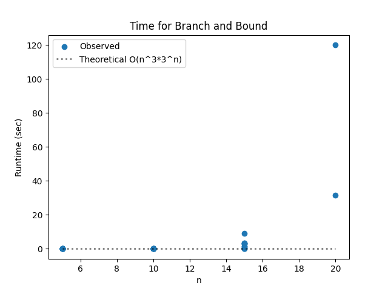

# Project Report - Branch and Bound

## Baseline

### Design Experience

I spoke to my brother Jeshua about my reduced cost matrix algorithm. It is actually super simple, just like the homework. 
I first subtract the minimum from each element in a row of a matrix(assuming it isn't 0 or infinity), add that to the cost every time,
and then I do the same for each element in the columns after the first reductions. 
I will use a list of a list to represent the matrix, should be easy to copy and modify, although iterating through elements will
take n^2 time. I believe other than a row having inf or 0 as its min value, there's no other edge cases. Maybe a matrix that's
already reduced. 

### Theoretical Analysis - Reduced Cost Matrix

#### Time 

Let's look at the annotated code for matrix reduction:

    
    def reduce_cost_matrix(matrix: list[list[float]]) -> tuple[list[list[float]], float]:
        n = len(matrix)
        m_copy = [row[:] for row in matrix]  #O(n^2)
        total_cost = 0.0
    
        #Row reduction
        for r in range(n):           #Runs O(n) times for every row
            row_min = min(m_copy[r])   #O(n), for every n element in that row
            if row_min == math.inf:
                continue
            if row_min == 0:
                continue
            total_cost += row_min
            for c in range(n):         #O(n) once again for every element in the row
                if m_copy[r][c] != math.inf:
                    m_copy[r][c] = m_copy[r][c] - row_min
    
    
        #Column reduction
        for c in range(n):          #O(n) times
            col_min = min(m_copy[r][c] for r in range(n)) #O(n)
            if col_min == math.inf:
                continue
            if col_min == 0:
                continue
            total_cost += col_min
    
            for r in range(n):                  #O(n)
                if m_copy[r][c] != math.inf:
                    m_copy[r][c] = m_copy[r][c] - col_min
    
    
        return m_copy, total_cost

We have O(n^2) for copy, and 2*O(n)*(O(n)+O(n)) for both row and col reduction. Total cost comes out to 
O(n^2).

#### Space

Let's look at the annotated code:

    
    def reduce_cost_matrix(matrix: list[list[float]]) -> tuple[list[list[float]], float]:
        n = len(matrix)               O(n)
        m_copy = [row[:] for row in matrix]  O(n^2) 
        total_cost = 0.0
    
        #Row reduction
        for r in range(n):
            row_min = min(m_copy[r])
            if row_min == math.inf:
                continue
            if row_min == 0:
                continue
            total_cost += row_min
            for c in range(n):
                if m_copy[r][c] != math.inf:
                    m_copy[r][c] = m_copy[r][c] - row_min
    
    
        #Column reduction
        for c in range(n):
            col_min = min(m_copy[r][c] for r in range(n))
            if col_min == math.inf:
                continue
            if col_min == 0:
                continue
            total_cost += col_min
    
            for r in range(n):
                if m_copy[r][c] != math.inf:
                    m_copy[r][c] = m_copy[r][c] - col_min
    
    
        return m_copy, total_cost

The copied matrix dominates the space complexity, leading to a O(n^2) complexity. 

## Core

### Design Experience

I spoke to my brother again. Branch and bound uses the reduced_cost matrix operation to evaluate the costs of different
paths it could take. It takes a step, which reflects on the matrix by removing the edge we took, and then matrix reduction
is used to evaluate which of the possible steps is the least costly. Any operation proving to be larger than the current 
min found can be pruned(or abandoned early). We repeat this until all edges have been traveled. 
The lower bound is the last total cost before taking another step, we use it as a starting point for the new cost after taking
other steps. 
I'll use a tuple with the path, matrix and cost up to now for each state. This will be costly, but necessary since each state
modifies the matrix differently. Since the reduced matrix operation is already O(n^2), and we will do that for every edge until
we arrive to the starting point the time complexity will easily become O(n^3) or greater, depending on the branching factor.
I'll take an educated guess on the first shot and then try to measure it more accurately with the empirical data. 

### Theoretical Analysis - Branch and Bound TSP

#### Time 

Annotated code:
    
    def branch_and_bound(edges: list[list[float]], timer: Timer) -> list[SolutionStats]:
        n = len(edges)
        solutions = []
        nodes_expanded = 0
        nodes_pruned = 0
        max_queue_size = 0
    
        inf_edges = [row[:] for row in edges]    #O(n^2)
        for i in range(n):                      #O(n)
            inf_edges[i][i] = math.inf
    
        greedy_stats = greedy_tour(edges, timer)   #O(n^3) for greedy_tour time complexity
        if greedy_stats:
            bssf_score = greedy_stats[-1].score
            bssf_tour = greedy_stats[-1].tour
        else: #No solution found
            bssf_score = math.inf
            bssf_tour = []
    
    
    
        root_matrix, root_cost = reduce_cost_matrix(inf_edges)  #O(n^2)
        stack = [([0], root_matrix, root_cost)]
    
        while stack and not timer.time_out():       #I don't know how many times this could compute. Once for every hop?
            if len(stack) > max_queue_size:
                max_queue_size = len(stack)
    
            path, matrix, cost = stack.pop()
            nodes_expanded += 1
    
            if cost >= bssf_score:
                nodes_pruned += 1
                continue
    
            current_city = path[-1]
    
            if len(path) == n:
                tour_score = score_tour(path, edges)    #O(n)
                if tour_score < bssf_score:
                    bssf_score = tour_score
                    bssf_tour = path
                    solutions.append(SolutionStats(path, tour_score, timer.time(), 0, 0, 0, 0, 0))
                continue
    
            visited = set(path)     #O(n)
    
            for next_city in range(n):      #O(n)
                if next_city in visited:
                    continue
                if matrix[current_city][next_city] == math.inf:
                    continue
    
    
                edge_cost = matrix[current_city][next_city]
                child_cost = cost + edge_cost
    
                child_matrix = [row[:] for row in matrix]  #O(n^2)
                for col in range(n):                            #O(n)
                    child_matrix[current_city][col] = math.inf
                for row in range(n):                            #O(n)
                    child_matrix[row][next_city] = math.inf
    
                child_matrix[next_city][path[0]] = math.inf
    
                child_matrix, reduction_cost = reduce_cost_matrix(child_matrix)   #O(n^2)
                child_cost += reduction_cost
    
                if child_cost >= bssf_score:
                    nodes_pruned += 1
                    continue
    
                stack.append((path + [next_city], child_matrix, child_cost))
    
        if not solutions and not math.isinf(bssf_score):
            solutions.append(SolutionStats(bssf_tour, bssf_score, timer.time(), 0,0,0,0,0))
    
    
        return solutions

Just the greedy tour puts us at O(n^3), but then within the while loop O(n^3) work is done for every expansion, which
comes out to O(n^3 * b^n), where b is the branching factor. Greedy_tour gives a pretty good starting point for pruning, so 
I'd guess b could be around 3 or 4. 

#### Space

Annotated code:
    
    def branch_and_bound(edges: list[list[float]], timer: Timer) -> list[SolutionStats]:
        n = len(edges)
        solutions = []        
        nodes_expanded = 0
        nodes_pruned = 0
        max_queue_size = 0
    
        inf_edges = [row[:] for row in edges]   O(n^2)
        for i in range(n):
            inf_edges[i][i] = math.inf
    
        greedy_stats = greedy_tour(edges, timer) #0(n^2) at worst

        if greedy_stats:
            bssf_score = greedy_stats[-1].score
            bssf_tour = greedy_stats[-1].tour        #O(n)
        else: #No solution found
            bssf_score = math.inf
            bssf_tour = []
    
    
    
        root_matrix, root_cost = reduce_cost_matrix(inf_edges)  #O(n^2) for copy matrix
        stack = [([0], root_matrix, root_cost)]   #O(n^2)
    
        while stack and not timer.time_out():
            if len(stack) > max_queue_size:
                max_queue_size = len(stack)
    
            path, matrix, cost = stack.pop()  #O(n^2)
            nodes_expanded += 1
    
            if cost >= bssf_score:
                nodes_pruned += 1
                continue
    
            current_city = path[-1]
    
            if len(path) == n:
                tour_score = score_tour(path, edges) 
                if tour_score < bssf_score:
                    bssf_score = tour_score
                    bssf_tour = path
                    solutions.append(SolutionStats(path, tour_score, timer.time(), 0, 0, 0, 0, 0))
                continue
    
            visited = set(path)   #O(n)
    
            for next_city in range(n):
                if next_city in visited:
                    continue
                if matrix[current_city][next_city] == math.inf:
                    continue
    
    
                edge_cost = matrix[current_city][next_city]
                child_cost = cost + edge_cost
    
                child_matrix = [row[:] for row in matrix]        #O(n^2)   
                for col in range(n):
                    child_matrix[current_city][col] = math.inf
                for row in range(n):
                    child_matrix[row][next_city] = math.inf
    
                child_matrix[next_city][path[0]] = math.inf    #O(n^2)
    
                child_matrix, reduction_cost = reduce_cost_matrix(child_matrix)
                child_cost += reduction_cost
    
                if child_cost >= bssf_score:
                    nodes_pruned += 1
                    continue
    
                stack.append((path + [next_city], child_matrix, child_cost))
    
        if not solutions and not math.isinf(bssf_score):
            solutions.append(SolutionStats(bssf_tour, bssf_score, timer.time(), 0,0,0,0,0))
    
    
        return solutions

The stack can hold values with up to O(n^2) complexity, up to b^n times because of branching, so space complexity comes
out to O(n^2 * b^n), where be might be around 3 or 4. 

### Empirical Data

| Size | Time (sec) |
|------|------------|
| 5    | 0.0        |
| 10   | 0.032      |
| 15   | 2.601      |
| 20   | 75.716     |

### Comparison of Theoretical and Empirical Results

- Empirical order of growth:  O(n^3 * 2^n)
- Measured constant of proportionality: 3.1 * 10^-8

Looks like my guess for the branching factor was actually higher than the real deal. The graph included part of the
size 20 runs, but those timed out halfway through so they aren't the most accurate. Other than that the graph matches my
theoratical analysis well except for the lower branching factor. 

## Stretch 1 

### Design Experience

*Fill me in*

### Search Space Over Time

*Fill me in*

## Stretch 2

### Design Experience

*Fill me in*

### Selected PQ Key

*Fill me in*

### Branch and Bound versus Smart Branch and Bound

*Fill me in*

## Project Report 

*Fill me in*

