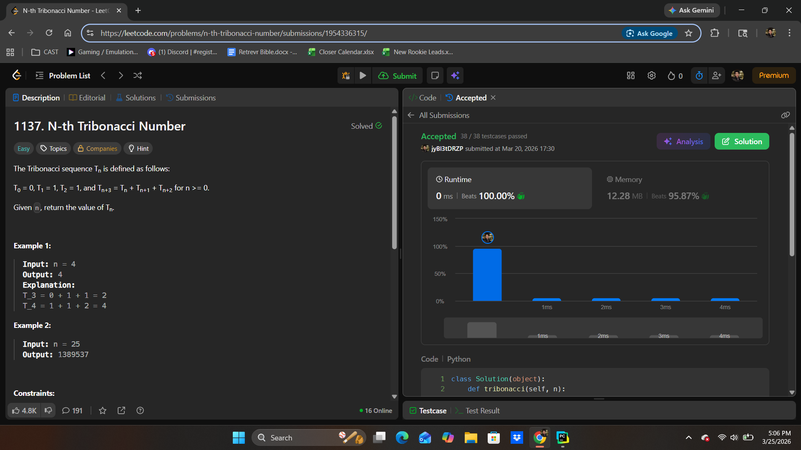
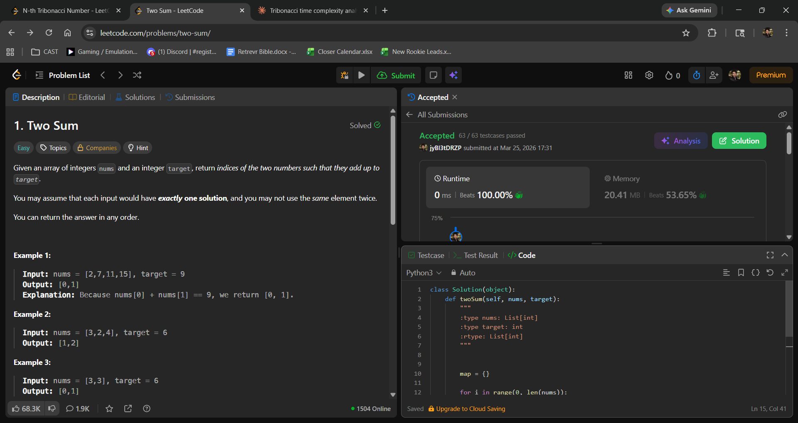
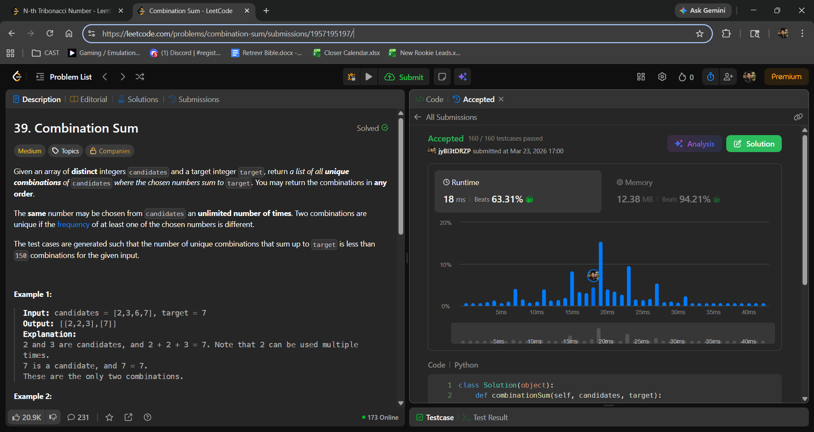
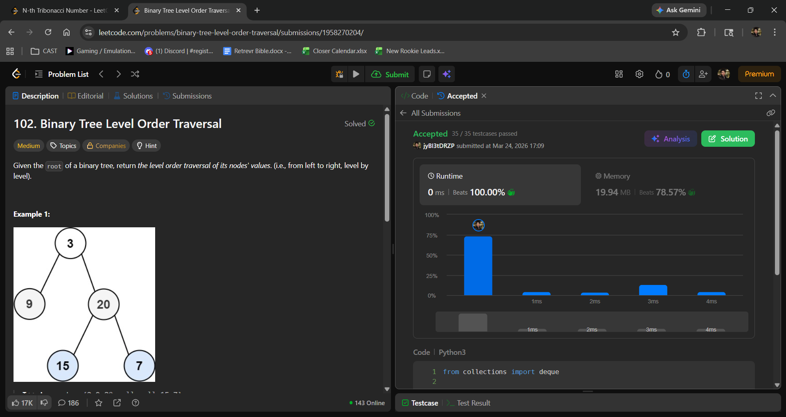

# Project Leetcode

### Problem 1 [25 points]

#### Problem Information

Problem Name: N-th Tribonacci Number

[Submission Link](https://leetcode.com/problems/n-th-tribonacci-number/submissions/1954336315/)

#### Time Complexity

Annotated code:

    class Solution(object):
        def tribonacci(self, n):
            """
            :type n: int
            :rtype: int
            """
            if n == 0:
                return 0
            if n == 1 or n == 2:
                return 1
    
            F = [0,1,1]
    
            for num in range(0, n):                   #O(n)
                F.append(F[num] + F[num + 1] + F[num + 2])
    
            return F[n]

The time complexity comes out to just O(n)

#### Space Complexity

Annotated code:

    class Solution(object):
        def tribonacci(self, n):
            """
            :type n: int
            :rtype: int
            """
            if n == 0:
                return 0
            if n == 1 or n == 2:
                return 1
    
            F = [0,1,1]    #O(n)
    
            for num in range(0, n):                   
                F.append(F[num] + F[num + 1] + F[num + 2])
    
            return F[n]

Space complexity comes out to #O(n), since the list F stores an element for every number n. 

----

### Problem 2 [25 points]

#### Problem Information

Problem Name: Two Sum

[Submission Link](https://leetcode.com/problems/two-sum/submissions/1959373178/)

#### Time Complexity

Annotated code:

    class Solution(object):
        def twoSum(self, nums, target):
            """
            :type nums: List[int]
            :type target: int
            :rtype: List[int]
            """
    
    
            
            map = {}
    
            for i in range(0, len(nums)):             #O(n)
                complement = target - nums[i]
                if complement in map:                  #O(1) lookup time
                    return i, map[complement] 
                map[nums[i]] = i
                
            return 0, 0
    
Time complexity comes out to O(n).

#### Space Complexity

Annotated code:

    class Solution(object):
        def twoSum(self, nums, target):
            """
            :type nums: List[int]
            :type target: int
            :rtype: List[int]
            """

            map = {}           #Stores O(n) elements in worst case
    
            for i in range(0, len(nums)):            
                complement = target - nums[i]
                if complement in map:                 
                    return i, map[complement] 
                map[nums[i]] = i
                
            return 0, 0

Space complexity comes out to just O(n).

----

### Problem 3 [25 points]

#### Problem Information

Problem Name: Combination Sum

[Submission Link](https://leetcode.com/problems/combination-sum/submissions/1957195197/)

#### Time Complexity

Annotated code:

    class Solution(object):
        def combinationSum(self, candidates, target):
            """
            :type candidates: List[int]
            :type target: int
            :rtype: List[List[int]]
            """
            
            solutions = []       
            
            def combRecursion(start, remaining, path):   
                if remaining == 0:
                    solutions.append(path[:])
                    return
                if remaining < 0:
                    return
    
                for i in range(start, len(candidates)):    #O(n)
                    path.append(candidates[i])
    
                    combRecursion(i, remaining - candidates[i], path)   #Can get called (target/min(candidates)) times
                                                                        #So the complexity here can be O(Target/min)
                    path.pop()
            
            combRecursion(0, target, [])       
    
            return solutions
                    
Time complexity is O(n) for the loop, and then each iteration can get called Target/min(candidate) times, which does a
O(n) loop again, and so forth. The time complexity comes out (at worst) to O(n^(Target/min)).
                

#### Space Complexity

Annotated code:

    class Solution(object):
        def combinationSum(self, candidates, target):
            """
            :type candidates: List[int]
            :type target: int
            :rtype: List[List[int]]
            """
            
            solutions = []                   #O(n^k), where k is at worst the max depth of each n iteration
                                            # Target/min(candidates). We represent k as T/m.
            
            def combRecursion(start, remaining, path):
                if remaining == 0:
                    solutions.append(path[:])
                    return
                if remaining < 0:
                    return
    
                for i in range(start, len(candidates)):
                    path.append(candidates[i])            #Path can grow up to T/m
    
                    combRecursion(i, remaining - candidates[i], path)
                    path.pop()
            
            combRecursion(0, target, []) #empty list can be O(n) at worst
    
            return solutions

Space complexity comes out to O(n^T/m), because a path that can grow up to T/m can be found and stored in the solutions
list n times for every element of the list "candidates". 

----

### Problem 4 [10 points]

#### Problem Information

Problem Name: Connected Points

[Submission Link](https://leetcode.com/problems/min-cost-to-connect-all-points/submissions/1958256538/)

#### Time Complexity

Annotated code:
    
    import math
    
    class Solution:
        def minCostConnectPoints(self, points: List[List[int]]) -> int:
    
            def distance(p1: List[int], p2: List[int]) -> int:
                return abs(p1[0] - p2[0]) + abs(p1[1] - p2[1])
    
            n = len(points)
            visited = [False] * n       #O(n)
            minDist = [math.inf] * n     #O(n)
            minDist[0] = 0
    
            totalCost = 0
    
            for i in range(n):              #O(n)
                min_index = -1
                min_value = math.inf
                for j in range(n):          #O(n) within O(n) = O(n^2)
                    if not visited[j] and minDist[j] < min_value:
                        min_index = j
                        min_value = minDist[j]
                
                u = points[min_index]
                visited[min_index] = True
                totalCost = totalCost + minDist[min_index]
    
                for j in range(n):           #O(n) again within O(n)
                    if not visited[j]:
                        cost = distance(u,points[j])
                        if cost < minDist[j]:
                            minDist[j] = cost
    
            return totalCost
     
Time complexity comes out to O(n^2).

#### Space Complexity

Annotated code:
    
    import math
    
    class Solution:
        def minCostConnectPoints(self, points: List[List[int]]) -> int:
    
            def distance(p1: List[int], p2: List[int]) -> int:
                return abs(p1[0] - p2[0]) + abs(p1[1] - p2[1])
    
            n = len(points)
            visited = [False] * n        #O(n)
            minDist = [math.inf] * n    #O(n)
            minDist[0] = 0
    
            totalCost = 0
    
            for i in range(n):          
                min_index = -1
                min_value = math.inf
                for j in range(n):
                    if not visited[j] and minDist[j] < min_value:
                        min_index = j
                        min_value = minDist[j]
                
                u = points[min_index]
                visited[min_index] = True
                totalCost = totalCost + minDist[min_index]
    
                for j in range(n):
                    if not visited[j]:
                        cost = distance(u,points[j])
                        if cost < minDist[j]:
                            minDist[j] = cost
    
            return totalCost
Space complexity comes out to O(n) + O(n) = O(n). 

----

### Problem 5 [10 points]

#### Problem Information

Problem Name: Binary Tree Level Order Traversal

[Submission Link](https://leetcode.com/problems/binary-tree-level-order-traversal/submissions/1958270204/)

#### Time Complexity

Annotated code:
    
    from collections import deque #O(1) time for appending / popping first or last element. 
    
    # Definition for a binary tree node.
    # class TreeNode:
    #     def __init__(self, val=0, left=None, right=None):
    #         self.val = val
    #         self.left = left
    #         self.right = right
    class Solution:
        def levelOrder(self, root: Optional[TreeNode]) -> List[List[int]]:
            if root == None:
                return []
            result = []
            queue = deque()
            queue.append(root)   #O(1)
    
            while queue:         #O(n) for every node in the tree
                levelSize = len(queue)
                currentLevel = []
    
                for i in range(levelSize):   #O(n) still, this simply helps iterate through every node. 
                    node = queue.popleft()
                    currentLevel.append(node.val)  #O(1) runtime for queue and list operations here. 
    
                    if node.left != None:
                        queue.append(node.left)
                    if node.right != None:
                        queue.append(node.right)
    
                result.append(currentLevel)
            
            return result
    
Time complexity comes out to O(n).

#### Space Complexity

Annotated code:
    
    from collections import deque
    
    # Definition for a binary tree node.
    # class TreeNode:
    #     def __init__(self, val=0, left=None, right=None):
    #         self.val = val
    #         self.left = left
    #         self.right = right
    class Solution:
        def levelOrder(self, root: Optional[TreeNode]) -> List[List[int]]:
            if root == None:
                return []
            result = []
            queue = deque()           #O(n) at worst if tree is very unbalanced
            queue.append(root)        
    
            while queue:
                levelSize = len(queue)
                currentLevel = []         #O(n) at worst
    
                for i in range(levelSize):
                    node = queue.popleft()
                    currentLevel.append(node.val)
    
                    if node.left != None:
                        queue.append(node.left)
                    if node.right != None:
                        queue.append(node.right)
    
                result.append(currentLevel)
            
            return result
    
Space complexity comes out to O(n).  

----

### Problem 6 [5 points]

#### Problem Information

Problem Name: *fill me in*

[Submission Link]()

#### Time Complexity

*Fill me in*

#### Space Complexity

*Fill me in*

----

### Problem 7 [5 extra credit points]

#### Problem Information

Problem Name: *fill me in*

[Submission Link]()

#### Time Complexity

*Fill me in*

#### Space Complexity

*Fill me in*

----

### Problem 8 [5 extra credit points]

#### Problem Information

Problem Name: *fill me in*

[Submission Link]()

#### Time Complexity

*Fill me in*

#### Space Complexity

*Fill me in*

----

### Problem 9 [5 extra credit points]

#### Problem Information

Problem Name: *fill me in*

[Submission Link]()

#### Time Complexity

*Fill me in*

#### Space Complexity

*Fill me in*

----

### Problem 10 [5 extra credit points]

#### Problem Information

Problem Name: *fill me in*

[Submission Link]()

#### Time Complexity

*Fill me in*

#### Space Complexity

*Fill me in*

## Project Review

*Fill me in*